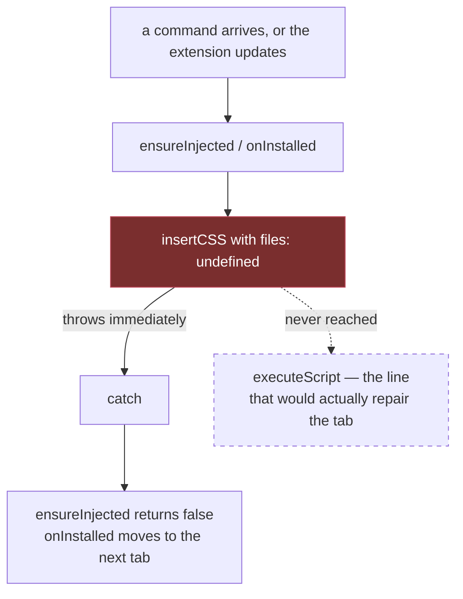
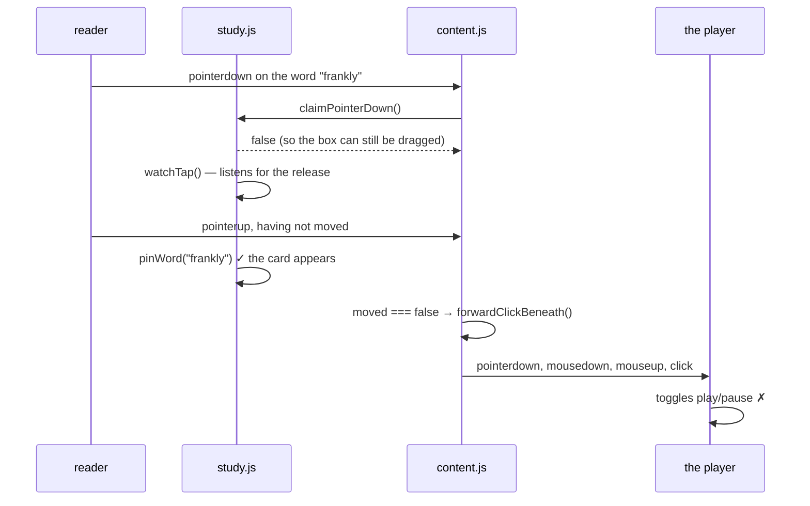

> [!TLDR]
> Fourteen defects. Nine were **executed** — driven in a real browser or in
> node until the symptom appeared — and five were **read only**, which the
> tables below say for each one.
>
> - **Two produce a wrong picture.** Attaching a second subtitle throws away
>   the measured ad time, putting the first one 90 seconds out. "Stop at the
>   end of each line" stops at every line at 1x, at one line in four at 2x, and
>   at none at 4x.
> - **Two lose the reader's own work.** A deck save that fails is announced as
>   "already saved" and the word is marked as known; two saves that overlap
>   leave one entry.
> - **One documented feature has never run.** The self-heal injection throws on
>   its first call, in both places it is used. The worker suite cannot see it
>   because its stub manifest supplies a key the real manifest does not have.
> - The performance findings are all on paths a viewer is on constantly: a map
>   drag writes to disk on every pointer move, and a study language with no
>   rarity table re-asks the worker for the same words forever.

## What happened next {#fixed}

Everything in the first four sections has been fixed, each with a check that
fails against the previous code carrying the reported symptom. The read-only
findings were re-examined and three of them fixed as well; the two that were
product questions rather than defects are named at the end.

```oku-table
{"k": "table", "headers": ["Commit", "What it did"], "rows": [["`7f51cba`", "Keep the ad correction when a second subtitle arrives"], ["`b71c100`", "Stop at the end of every line, whatever speed the film is running at"], ["`1c49a09`", "Say so when a word is not saved, and let the deck take one writer at a time"], ["`1564b58`", "Make the injection that repairs a stale tab actually run"], ["`41d6b07`", "Looking a word up is not also a press on the film"], ["`8d14408`", "Never drop a rejection at a boundary a handler cannot await"], ["`5b01873`", "Ten smaller defects from the same review"], ["`167ac5c`", "Bring the documents back in line with what the code does"]]}
```

Two things the fixing established that the review had not. The aligner's real
difficulty with this series is **segmentation, not timing**: 1173 English cues
against 915 Turkish for the same episode, with a median gap of 505ms between
nearest cue starts against a 250ms tolerance, so only a quarter of the lines
ever pair. And the corpus separates cleanly on coverage where it does not on
confidence, which is what made a one-directional gate possible.

The one finding that was **wrong** is recorded rather than removed: the study
rail put away does still build cards and spend a lookup, but the first probe
measured a cached path and reported zero. The section below carries the
corrected measurement.

## What was reviewed, and what counts as evidence {#scope}

The browser extension: `content.js`, `panel.js`, `study.js`, `background.js`,
the study modules, the four stylesheets and the manifest. The daemon, the
translator, the viewer and `subgen` were not opened — they are separate
programs and mixing them in would have meant reading everything shallowly.

The distinction that matters in every row below: **reading code establishes a
mechanism; it does not establish that anything happens.** Where a defect could
be triggered, it was triggered, and the measurement is quoted. Where it was
not, the row says "read" and should be treated as a claim rather than a
finding.

```oku-table
{"k": "table", "headers": ["Area", "How it was attacked", "Evidence"], "rows": [["Ad-time correction across two attaches", "Injected an ad marker, advanced the stream 90s, then attached a second subtitle and read the drift back", "Executed"], ["Stop at the end of each line", "Replaced the harness's static clock with one that really runs, at 1x, 2x and 4x, over six lines", "Executed"], ["The deck", "Failed the save the way the worker fails it, and raced two saves against a 5ms store", "Executed"], ["Programmatic injection", "Loaded the unpacked extension into Chrome and called the two worker paths from the service worker", "Executed"], ["Study-mode pointer contract", "Dispatched a real press-release on a word and counted what the player received", "Executed"], ["Storage traffic", "Counted chrome.storage.local.set over a 60-sample map drag and a two-second nudge hold", "Executed"], ["Control sizes, contrast, focus", "Measured every rendered control in the panel and the rail, and both focus states", "Executed"], ["Rarity round trips", "Answered rank() the way an unsupported language answers it, over eight cue changes", "Executed"], ["Diagnostic report paths", "Confirmed the shadowing in node, then read the call sites", "Executed"], ["Search and Try-the-best failure paths, drift notes, saved-card titles", "Read", "Read only"]]}
```

## Two wrong pictures {#wrong}

### Attaching a second subtitle throws away the ad correction

`attach()` sets `state.adDriftMs = 0` and `state.inAd = false`. That field is
deliberately **shared** — its own comment says "an ad interrupts the video, not
one of the subtitle files" — so clearing it on a per-track operation discards a
measurement that belongs to the other track as well.

Driven with an ad marker on screen for a break that advanced the stream by 90
seconds, then a second subtitle attached to the empty slot:

```oku-chart
{"k": "chart", "type": "bar", "title": "Measured ad time held by the overlay (ms)", "y_label": "adDriftMs", "rows": [{"label": "after the ad break, before anything else", "value": 90000}, {"label": "after attaching a second subtitle", "value": 0}]}
```

Subtitle 1 was correctly compensated and is now ninety seconds out, with
nothing on screen saying why. The reader's reading of it is "the sync broke
when I added the second language".

This is the ordinary path for the setup the tool is built for. Prime stitches
ads into the same stream, the dual-language flow is *attach one, then attach
the other*, and the auto-attach path fills the two slots in sequence — so a
break landing between the two calls has the same effect with nobody touching
anything.

### "Stop at the end of each line" stops working above 1x

`pauseAtLineEnd` fires only when a tick lands inside `[cue.end − TICK_MS,
cue.end]` measured in film time. That window is exactly one tick wide. There is
a lower bound (`if (now < cue.end - TICK_MS) return`) and no upper bound, and
the upper bound arrives implicitly from `findCueIndexes`: once the playhead is
past `cue.end` no cue covers the moment, so there is nothing to stop at.

The harness cannot see this — its `currentTime` is a static stub that only
moves when a test assigns it. Replacing it with a clock driven by wall time and
a playback rate, over lines at 10–13, 15–18, 20–23 and 25–28 seconds:

```oku-chart
{"k": "chart", "type": "bar", "title": "Lines the film actually stopped at, out of four", "y_label": "stops", "rows": [{"label": "1x playback", "value": 4}, {"label": "2x playback", "value": 1}, {"label": "4x playback", "value": 0}]}
```

At 1x it stopped at 12.99, 17.97, 22.99 and 27.96 — the end of every line, and
the feature works exactly as described. At 2x the playhead advances about
100 ms of film per 50 ms tick, so it covers the 50 ms window only when the tick
phase happens to suit: it stopped once and then never again. At 4x it advances
200 ms per tick and skipped every line.

Nothing recovers. Once a line's end is passed without stopping, the reader is
in the next line with no signal that the mode is on.

> [!NOTE]
> The same arithmetic applies at 1x whenever a tick is delayed past 50 ms,
> which a busy streaming page does regularly. That case was not reproduced —
> only the playback-rate one was — so treat the jank version as the mechanism
> rather than as an observation.

## Two ways the reader's own work is lost {#deck}

The deck is the part of study mode that survives the film. Both defects below
are in the two lines between pressing Save and being told what happened.

### A save that failed is announced as a duplicate

`saveCard` writes its own outcome before it looks at the answer:

```js
const response = await api.daemon("deckSave", { entry: { … } });

card.saved = true;                                   // before the check
savedTerms.add(`${card.language}:${card.term}`);     // before the check
redrawCard(card);
remarkCurrent();
api.showToast(
  response?.added ? `Saved "${card.term}" with its line`
                  : `"${card.term}" is already saved`,   // the only branch
);
```

`background.js` answers `{ transportError: … }` whenever `deck.save` throws —
a storage quota, a disk error, a worker torn down mid-call. That object has no
`added`, so it takes the second branch.

Driven with `deckSave` answering exactly that:

```oku-table
{"k": "table", "headers": ["What happened", "What the reader is told", "What the extension then believes"], "rows": [["The save failed with QUOTA_BYTES quota exceeded", "\"the\" is already saved", "The word is in savedTerms; every occurrence in the subtitle is marked data-saved=\"true\""]]}
```

The second column is the damage. A word marked as met is excluded from future
rare-word marking (`if (isRare && !known) rare.push(...)`), so the word the
reader tried to keep stops being offered to them — quietly, and for the rest of
the session.

### Two overlapping saves leave one entry

`deck.save` reads the whole deck, appends, and writes the whole deck back, on
one `chrome.storage.local` key, with no lock. Two calls that overlap both read
the array before either writes it.

Run in node with a 5 ms store round trip:

```js
await Promise.all([
  deck.save({ term: "warrant", language: "en", fileId: 1 }),
  deck.save({ term: "reckon",  language: "en", fileId: 1 }),
]);
// deck holds: [ 'reckon' ]      -> LOST 1 of 2
```

Reachable by pressing the save key twice in quick succession — `saveCard`
guards on `card.saved`, but sets it only after the await — by clicking Save on
one card while another is in flight, or from two tabs at once.

## Three things that do not do what they say {#says}

### The self-heal injection has never run

`background.js` re-injects the content scripts in two places: `onInstalled`,
which sweeps every open tab, and `ensureInjected`, which repairs a stale tab
before a command. Both start the same way:

```js
const scripts = chrome.runtime.getManifest().content_scripts?.[0];
await chrome.scripting.insertCSS({ target: { tabId, allFrames: true }, files: scripts.css });
await chrome.scripting.executeScript({ target: { tabId, allFrames: true }, files: scripts.js });
```

`content_scripts[0]` in `manifest.json` has a `js` array and **no `css` key**,
so `files` is `undefined`. Loaded unpacked into Chrome and called from the
service worker:

```
insertCSS:     THREW - Exactly one of 'css' and 'files' must be specified.
executeScript: THREW - Cannot access contents of url "https://example.com/".
               Extension manifest must request permission to access this host.
```

Both call sites wrap the two calls in one `try`, so the `executeScript` after
the throw never runs.



The consequence is the sentence in `README.md`: *"The service worker now
re-injects on install and update, and repairs a stale tab on the next command,
so a page reload should no longer be necessary."* It does not, and the symptom
is the one the README warns about two paragraphs earlier — changes that look
like they did nothing until the tab is reloaded by hand.

**Why the suite is green.** `tests/worker.mjs` stubs the manifest as
`content_scripts: [{ js: [], css: [] }]`, supplying the very key the real
manifest lacks, and stubs `insertCSS` as a no-op that accepts anything. The
stub is more forgiving than the API at exactly the point that decides the
outcome.

The second error is a separate, smaller finding: `chrome.scripting.executeScript`
needs a host permission for the target, and the manifest declares
`host_permissions` only for the daemon and OpenSubtitles. The command path is
fine — `activeTab` is granted when a `commands` shortcut fires — but the
`onInstalled` sweep over already-open tabs has no such grant and cannot work
even once `insertCSS` is fixed.

### Clicking a word to pin it also plays or pauses the film

`study.js` states its own contract at the top of the file:

```
hover a word          look it up            (no click - the film is playing)
click a word          pin it, stop the fade
click anywhere else   pause, exactly as before
```

`claimPointerDown` returns `false` for a plain tap, deliberately, so the
subtitle stays draggable by its words. Nothing then tells `content.js` that the
tap was consumed, so on release the ordinary path runs: `moved === false`
means "this was a click", and `forwardClickBeneath` hides the cue boxes,
hit-tests underneath and dispatches a click to the player.



Measured on that exact gesture: one card named `frankly` in the rail, **one
click delivered to the player**, and `video.paused` moved from `false` to
`true`. The film stopped because a word was looked at.

It also empties the setting built for this. "Pause when a word is clicked"
(`pauseOnPin`, off by default) cannot be off — the film pauses regardless — and
when the film is already paused, clicking a word starts it playing.

### The diagnostic report's element paths are not paths

`describeNode` is declared twice at the same scope in `content.js`:

```oku-table
{"k": "table", "headers": ["Line", "What it returns", "Who was meant to use it"], "rows": [["797", "div > ul > li > a — four ancestors, for pasting into a bug report", "episodeMarkers(), as the `path` field of every reported marker"], ["1032", "DIV#x.cls z=auto pe=auto — one element plus its computed z-index and pointer-events", "describeSurfaces(), for naming what is covering a button"]]}
```

Function declarations hoist, so the second wins for **every** call site,
including the one written 235 lines above it. Confirmed in node: a call placed
before the second declaration still reaches it.

So the diagnostic report — the surface built for the case where a page does not
work and nobody can say why — prints a computed-style string in the column
labelled as an element path, for up to forty markers, and calls
`getComputedStyle` on each of them. The first function is dead code.

## What it costs while nothing is wrong {#cost}

None of these changes what the tool does. All are on paths a viewer is on while
watching.

### Persistent storage is written on every pointer move

`setOffset` calls `saveOffset`, which calls `chrome.storage.local.set`,
unconditionally. Two gestures reach it at pointer rate: dragging the timeline
strip on a card (`api.setOffset` on every `pointermove`), and holding a nudge
button (every 80 ms).

```oku-chart
{"k": "chart", "type": "bar", "title": "chrome.storage.local writes per gesture (measured)", "y_label": "writes", "rows": [{"label": "60-sample drag across the timeline strip", "value": 60}, {"label": "two-second hold on one nudge button", "value": 24}, {"label": "what one debounced write would cost", "value": 1}]}
```

The debounce this wants already exists eleven lines away: `rememberTimingSoon`
waits 800 ms for exactly this reason, with the comment *"what is worth
remembering is where the reader stopped, not every step on the way."* It was
applied to the release memory and not to the offset itself.

### A study language with no rarity table asks forever

`rank()` answers `{}` for anything outside `["en", "tr"]`. `ranksFor` then
skips every word, because `undefined` is deliberately distinguished from "not
in the table" — so nothing is written to `rankCache` and the next line asks
again.

Answering `rank` the way an unsupported language answers it, over eight cue
changes:

```oku-table
{"k": "table", "headers": ["What was measured", "Result"], "rows": [["Round trips to the worker over 8 cue changes", "9"], ["Word sets asked for more than once", "[\"reckon\",\"the\",\"warrant\",\"quarry\"] asked twice within the run"], ["Words marked on screen", "none, ever"], ["What the reader is told", "nothing"]]}
```

Two things follow. The traffic is permanent, because the cache can never fill.
And the reader studying a third language sees a rail that says "Rare words
appear here as they are said" and stays empty for two hours, with no sentence
anywhere saying the language has no table.

### The rail put away keeps filling itself

The hover path guards this explicitly:

```js
// With the rail put away the popup is the whole answer; adding to a list
// nobody can see would only spend lookups.
if (settings.showRail) addCard(term, { rank: rankOf(word), language, slot });
```

The auto-marking path in `markWords` does not carry the guard. Measured with
the rail's host at `display: none` and 0 px wide: two cards built into it and
one dictionary lookup spent. The fix landed on one of the two callers.

> [!NOTE]
> The first probe of this reported **zero** lookups and was wrong. It re-showed
> a line whose words were already in the session's lookup cache, so it measured
> the cache rather than the path. The figures above are from a second run over
> words the cache had never seen. Worth stating because the corrected number is
> the one that makes this a defect rather than a tidiness note.

### `status()` sweeps the document for every caller

`pickVideoCached` was added to keep `pickVideo` off the pointer path, at a
250 ms cache. `status()` still calls the uncached `hasPlayableVideo()`, and
`panel.js` calls `status()` from 33 sites — twice per hold-repeat tick, once
per playhead frame. Measured: one document-wide `video` sweep per `status()`
call, five per second with the panel open and idle. Small, and it is the same
fix applied to one caller and not the rest.

## Reading it, and reaching it {#reach}

The stylesheets are in better shape than most of this review — `:focus-visible`
rings, `prefers-reduced-motion` in all four files, no `innerHTML` anywhere, and
**zero** controls in the control panel under the 24×24 minimum. The findings
here are narrow.

### Nothing the extension says is announced

The toast is the extension's only channel for "Subtitle 1 on — 1183 lines",
"Ad break over — subtitles shifted 90s", "daily download limit reached", and
every Undo it offers. Measured on a live toast:

```oku-table
{"k": "table", "headers": ["Attribute", "Value"], "rows": [["role", "null"], ["aria-live", "null"], ["rendered text", "Subtitle 1 on - 5 lines"]]}
```

A screen reader is never told any of it. `sayOnCard`, which takes over from the
toast whenever the panel is open, has the same gap. This is one attribute on
one element and one on the card's `said` node.

### The rail's own text slider reaches 6 px

The rail's small type is sized in `em` off `--sso-study-text`, so the slider
that sets the body size scales everything under it.

```oku-chart
{"k": "chart", "type": "bar", "title": "Rendered font size in the study rail (px)", "y_label": "px", "rows": [{"label": "language tag — at the 15px default", "value": 8.16}, {"label": "language tag — at the slider minimum", "value": 5.98}, {"label": "part of speech — at the slider minimum", "value": 6.58}, {"label": "rank readout — at the slider minimum", "value": 7.48}, {"label": "definition — at the slider minimum", "value": 9.68}]}
```

Contrast is 4.65:1 throughout, which clears AA for normal text and does not
help at these sizes. The slider's minimum is 11 px and the label under it says
"Text size", so nothing warns that three of the card's fields drop below
7 px on the way there — on a surface deliberately read at a glance, in the
dark, over a moving picture.

### Three smaller ones

```oku-table
{"k": "table", "headers": ["What", "Measured", "Consequence"], "rows": [["A track card is role=\"button\" and contains 12 buttons", "role=\"button\", 12 nested <button> elements", "Nested interactive content inside a button role. The panel root carries no role or aria-label either."], ["Rail card controls under 24×24", ".sso-card__caret 11×26, .sso-card__drop 15×26", "The caret is duplicated by the whole card head being clickable. The drop — remove this word — is not, and it is the destructive one."], ["The offset field loses the panel's focus ring", "At keyboard focus: outline none, border rgba(255,255,255,.11), background rgba(0,0,0,.25) — identical to its hover state", "input[type=number]:focus { outline: none } suppresses .sso-win :focus-visible, and the more specific .sso-sync__field:hover,:focus sets the replacement to --sso-line. One control, not a class: the search box does get an accent border."]]}
```

## Read, and not executed {#read-only}

Each of these is a mechanism in the code that was not triggered. They are
claims, not observations, and the reason each was left is given rather than
implied.

```oku-table
{"k": "table", "headers": ["What", "Consequence if it fires", "Why it was left"], "rows": [["runSearch and tryBest have no try/catch", "A rejected api.daemon() — extension context invalidated after an update, worker gone — leaves the note at \"Searching…\" forever, or el.tryBest.disabled true for the life of the panel. runDiagnostic has the try/finally the other two want.", "Needs the worker to vanish mid-call, which is reachable but was not staged."], ["filmTitle() reads trackInfo(studiedSlots()[0])", "A card saved from the second studied subtitle carries the first one's film label. saveCard deliberately reads card.slot for fileId — its comment says \"with two being studied that names the wrong film file half the time\" — and then calls filmTitle(), which does exactly that.", "The fix is one argument; the defect is plain from the two adjacent lines."], ["attach() sets state.visible = true", "Hiding the subtitles does not survive the next attach. With per-site auto-attach on, a new episode turns them back on by itself.", "Confirmed by driving the API (visible went false → true), but whether it is a defect or the intent is a product question, not a code one."], ["track.corrections uses shift() past 8 notes", "The drift estimate is a straight line through the first and last correction. shift() drops the earliest, while the comment says the extras are kept \"so a reader who nudges several times early still has an early point to measure from\". Past eight nudges the span narrows toward the recent window and a real drift can stop clearing the 20-minute bar.", "Needs nine hand corrections over twenty minutes to observe."], ["lookupCache in study.js is unbounded", "It holds one entry per word per language pair for the life of the page. rankCache next to it has a 20,000 limit and an eviction.", "Bounded in practice by a film's vocabulary. Listed for symmetry, not urgency."]]}
```

One orphan, flagged by the language server rather than by this review:
`titleEl` in `study.js` is assigned at line 855 and never read.

## What to fix first {#next}

Ordered by what the reader loses, not by effort. The first two change what is
on screen; the next two lose data; the fifth is a documented feature that has
never run.

```oku-chart
{"k": "chart", "type": "scatter", "title": "Effort against what it costs the reader (top-left first)", "x_label": "Effort →", "y_label": "Cost to the reader →", "series": [{"color": "accent", "label": "Wrong picture", "data": [{"x": 1, "y": 9, "label": "Keep ad drift across attaches"}, {"x": 3, "y": 8, "label": "Pause at line end above 1x"}]}, {"color": "warn", "label": "Lost work", "data": [{"x": 1, "y": 8, "label": "Honest save failure"}, {"x": 2, "y": 7, "label": "Lock the deck write"}]}, {"color": "success", "label": "Never ran", "data": [{"x": 1, "y": 6, "label": "insertCSS / self-heal"}, {"x": 2, "y": 5, "label": "Claim the word tap"}]}]}
```

```oku-step-flow
{"k": "step-flow", "ordered": true, "steps": [{"t": "Stop attach() clearing the shared ad drift", "meta": "content.js — one condition", "b": "Move the two lines out of `attach()`, or scope them to the case where nothing is attached yet. Everything else about the ad correction already works: it measured 90,000ms correctly and then discarded it."}, {"t": "Give the line-pause an upper bound", "meta": "content.js — one variable", "b": "The window is one tick wide because the test is a lower bound with an implicit ceiling at `cue.end`. Remember the last cue the playhead was inside; when it changes and that cue was never paused at, pause then. Removes the dependence on tick phase."}, {"t": "Let a failed save say so", "meta": "study.js — three lines", "b": "Move `card.saved = true` and `savedTerms.add(...)` below the response check, and give `transportError` its own sentence. It stops the deck quietly discarding words the reader tried to keep."}, {"t": "Serialise the deck write", "meta": "study/deck.js", "b": "A promise chain is enough — every save awaits the previous one's write before its own read. The measured loss is one entry in two."}, {"t": "Fix the injection, then decide about the permission", "meta": "background.js + manifest.json", "b": "Drop the `insertCSS` call (there is no content-script CSS to insert) or pass a real `files` array. Then decide whether the `onInstalled` sweep is worth `<all_urls>`; without it that half stays dead for a different reason, and the README should stop promising it."}]}
```

Two things deliberately **not** recommended:

- **Making the word tap suppress the forwarded click** is the obvious fix for
  the play/pause defect, and it is a contract change between two files:
  `claimPointerDown` currently means "I am taking this press" and the tap needs
  "I took this release". Worth doing, worth designing rather than patching —
  the reason it returns `false` today is that the subtitle must stay draggable
  by its words, and any fix has to keep that.
- **The rarity-table gap** could be closed by marking nothing quietly, which is
  what happens now, or by saying so once per attach. The second is a product
  decision about a feature that only ships two languages; it is listed as a
  finding, not as work.

## How to reproduce any of this {#verify}

Everything above was driven from three probe pages that load `src/*.js` from
disk against a stubbed `chrome`, plus one Chrome launch with the extension
loaded unpacked. Nothing in the repository was modified.

```oku-table
{"k": "table", "headers": ["Finding", "What reproduces it"], "rows": [["Ad drift cleared by a second attach", "Attach to slot 0, show an element matching AD_MARKERS for >2s while advancing currentTime, remove it, read status().adDriftMs, then attach to slot 1 and read it again."], ["Line pause above 1x", "Replace the harness's static currentTime with a getter driven by wall time and a rate. The static stub cannot show this — it only moves when a test assigns it, so every assignment lands wherever the test chose."], ["Failed save reported as a duplicate", "Answer the deckSave op with { transportError: \"…\" } — what background.js returns when deck.save throws — then read the card and the data-saved attributes on the words."], ["Deck write race", "Two deck.save() calls in one Promise.all against a storage stub with a 5ms round trip."], ["insertCSS throwing", "chromium.launchPersistentContext with --load-extension, then evaluate the two calls in the service worker context."], ["Word tap reaching the player", "Bind a click listener on the player element, dispatch pointerdown then pointerup on a .sso-w span without moving, and count."], ["Storage traffic", "Wrap chrome.storage.local.set with a counter and call api.setOffset 60 times, or hold a .sso-nudge button for two seconds."]]}
```

The three checks the extension already runs — `node tests/worker.mjs`, the two
browser suites — were not re-run as part of this and are not claimed to be
green or otherwise. The one thing this review establishes about them is the
stub gap in `tests/worker.mjs` described under the injection finding: a manifest
stub that carries a key the real manifest does not have, and a `chrome.scripting`
stub that accepts arguments the real API rejects.
