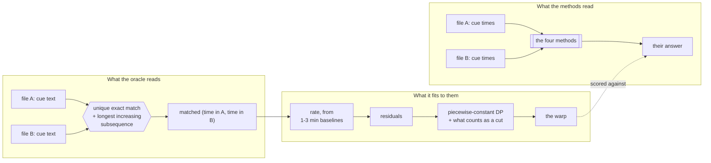
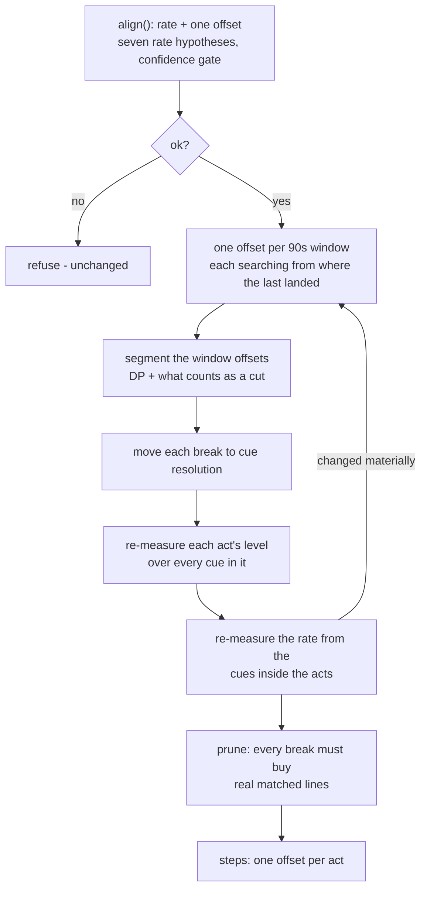

> [!TLDR]
> A single shift is the right model for **55%** of the pairs measured. For 30% the
> truth is a staircase of five or six steps, and for 12% a framerate ratio. The
> shipped aligner handles the first two kinds and cannot express the third.
>
> - The truth comes from **cue text**, not from timings, so it owes nothing to any method under test. It settles 137 of 283 same-film pairs and refuses the rest out loud.
> - Every staircase in the corpus is broadcast television with advertising. Every framerate ratio is a title old enough to have had a PAL DVD.
> - **`alignSteps` ships**: 95.8% of the film inside 250ms against the previous 86.4%, and on staircase pairs a median of 90% against 50%.
> - It makes **no pair worse** - and the first version made four worse, which is why the regression gate exists.

This is a report on a measurement, written to be re-read while changing the
code it describes. Every number in it is re-runnable from
`bench/align/`; the scripts are named where the numbers come from.

The question it answers is the one behind *"I needed to correct the sync
multiple times"*: not how far apart two subtitle files are, but what SHAPE
they are apart by, and whether the thing that answers that question is asking
the right one.

## Why the old truth was the easy half {#why}

The bake-off had no ground truth for the shifts. It built a consensus: a pair
where the methods land within 250ms of each other is "settled" at their
median, and the rest are reported as disputed rather than averaged into a
truth.

That is honest about not knowing, and it has one failure it cannot see. **The
settled pairs are the pairs the methods find easy.** 29 of 93 same-film pairs
sat outside the timing table on those grounds, and those 29 were the ones
worth measuring - which is the shape of
[judging a removal stage by measuring what it kept](#reading).

There was a second problem underneath it, and it was arithmetic. The bench
compared `shiftMs` across methods to decide who agreed with whom, and one of
those methods returns a shift that means nothing without its rate:

```oku-table
{"headers":["What the method said about Amélie's two BluRay releases","As the bench compared it","What it means"],"rows":[["`starts`: rate 1.041667, shiftMs 167","187","`y = 1.041667x + 167` — right to a millisecond"],["`overlap`: shiftMs 113500","113500","`y = x + 113500` — 62 seconds out at the median"],["`anchors`: shiftMs 113533","113533","the same peak, found the same way"],["**bench's verdict**","**\"disputed, nobody agrees\"**","one right answer and two wrong ones, filed as three opinions"]]}
```

Every pair whose releases differ by a framerate was recorded that way, and
those pairs were then excluded from the timing table for disagreeing. Scoring
a **mapping** rather than an offset is the fix, and it is why the interface
under test is now a function `at(x)` rather than a number.

## A truth that owes nothing to any clock {#truth}

The one part of a subtitle file that no alignment method reads is **the
text**. Two releases of the same film in the same language usually carry the
same words - one file is very often a re-timing of the other - so matching
cue text gives a correspondence that owes nothing to any timing, and every
matched pair is a point on the true warp.



The matching is unique-exact-text plus a longest increasing subsequence,
which is the anchor trick `diff` uses. A line that appears exactly once in
each file and reads identically is not a coincidence; requiring the matches
to run in the same order in both files throws away the few that are.

**It refuses rather than guesses.** Of 283 same-film pairs it settles 137. Of
the 146 it refuses, 131 are cross-language and have no shared text by
construction, and 15 are independent transcriptions in the same language with
too few identical lines to anchor on. Both refusals are printed; neither is
quietly filled in.

> [!NOTE]
> The oracle is biased towards pairs where one file descends from the other,
> because those are the ones that share text. That is also the population
> where its answer is exact - matched cues agree to the millisecond. Where two
> subtitlers timed the same release independently they disagree by 130 to
> 170ms on every line, and no aligner can beat that floor however right its
> model is. The floor is reported per pair alongside the error.

### Three wrong answers on the way to it {#wrong}

Each was found by an output that was wrong in a way no test would have
caught, and each is worth knowing because the same mistakes are available to
anyone rebuilding this.

```oku-step-flow
{"steps":[{"t":"Theil-Sen read a staircase as a slope","b":"The obvious rate estimator takes the median slope over every pair of anchors. A staircase accumulates its steps into every long baseline, so the median long-baseline slope reads the steps AS a slope. On the pair of Turkish files for The Americans S02E09, which share a framerate exactly, it returned 0.99311 - and flattening that phantom 0.7% needed 59 segments. Measuring the slope over one-to-three-minute baselines instead leaves only the few spans that straddle a step contaminated, which is what a median is for. It returns 1.00000."},{"t":"A shared timestamp is not a shared moment","b":"A two-speaker exchange is one cue in some files and two cues sharing a start in others, so two different lines legitimately carry the same timestamp - and one of the two matches is that point plus however far apart the speakers were. The Pilot pair came back with its residual alternating by ±1500ms and was read as 221 segments of structure. Anchors are now injective in TIME, not only in index."},{"t":"A segmenter paid in squared error does not know what a cut is","b":"It separated Sherlock's residual into 105 segments whose levels ran 1376, 1418, 1376, 1418 - the 40ms frame grid at 25fps, read as a staircase. A break now has to move the clock by 250ms and keep it moved for 30 seconds, which is what distinguishes a release cut from a subtitler nudging four lines."},{"t":"A median cannot see a large minority","b":"The model chooser compared MEDIAN residuals. Two Amélie releases agree to 200ms for 57 minutes and then jump 770ms for the remaining 54, so 60% of anchors sit on the first plateau and the median absolute residual of the one-shift model is 40ms. The pair was declared flat. The bench then recorded the method that FOUND that step as a regression, because it disagreed with a truth that was wrong. The statistic is now the share of anchors inside 250ms - the same quantity the accuracy table reports, and one a majority cannot carry."}],"ordered":true}
```

The penalty on extra segments is scaled by each pair's own noise, and the
calibration is the point of the exercise rather than a footnote:

```oku-table
{"headers":["Penalty (× noise variance)","Pairs that need ONE segment","Pairs that need SIX"],"rows":[["1","1","6"],["3","1","6"],["6","1","6"],["12  ← shipped","1","6"],["25","1","6"],["50","1","6"],["200","1","6"]]}
```

Over a two-hundred-fold range of the tuning knob, pairs known to need one
segment get one and pairs known to need six get six. **The answer does not
depend on the tuning.** Before the "what is a cut" rules existed, the same
table ran from 175 segments down to 6 and every row was a different finding.

## What real pairs actually differ by {#census}

The corpus is 178 subtitle files over 54 films and episodes, 70 of them
downloaded for this measurement. Titles were chosen against two hypotheses:
staircases come from advertising, so the television half is deliberately
ad-break television rather than HBO; framerate ratios come from PAL, so the
film half leans on titles old enough to have had a European DVD.

```oku-chart
{"type":"bar","title":"The simplest model that fits, over 137 pairs","rows":[{"label":"one shift","value":75,"display":"75 pairs · 54.7%"},{"label":"a staircase","value":41,"display":"41 pairs · 29.9%"},{"label":"a framerate ratio","value":16,"display":"16 pairs · 11.7%"},{"label":"none of the three","value":5,"display":"5 pairs · 3.6%"}]}
```

Both hypotheses hold, and the breakdown by title is the evidence rather than
the summary:

```oku-table
{"headers":["Title","one shift","framerate","staircase"],"rows":[["Interstellar, Arrival, Aliens, Blade Runner, Fargo, Chernobyl, The Dark Knight, Grand Budapest","6 each","0","0"],["Amélie","4","6","5"],["Sherlock S01E01","3","3","0"],["Mad Men S01E01","3","3","0"],["24 S01E01","3","3","0"],["House S01E01","1","2","3"],["Lost S01E01","1","1","4"],["The Americans (5 episodes)","3","1","11"],["Back to the Future","3","0","3"],["Battlestar Galactica S01E01","0","0","1"]]}
```

Every staircase in the corpus is broadcast television with advertising. Every
framerate ratio is a title with a PAL-era release. The eight films with no
break and no PAL DVD are flat across all six of their pairs.

> [!IMPORTANT]
> **This number moved once and the direction matters.** On the previous
> corpus - 96 files, 27 settled pairs - a staircase was the truth for 44% of
> them. It is 30% here. The first number was The Americans, which was 20 of
> those 27 pairs. Anything read off the earlier corpus about how common each
> shape is describes that show.

### What one shift costs on each kind {#cost}

The error a shift-only aligner is left with **even when it finds the best
shift that exists**, against the floor set by the two subtitlers' own
disagreement:

```oku-table
{"headers":["Truth","pairs","median p50 error","median p95 error","worst p95","median floor"],"rows":[["one shift","75","2ms","42ms","1136ms","0ms"],["a framerate ratio","16","24710ms","50102ms","144183ms","1ms"],["a staircase","41","1759ms","5254ms","143460ms","170ms"],["none of the three","5","12275ms","26317ms","26964ms","165ms"]]}
```

A framerate mismatch is not a subtitle that is slightly out. Amélie's two
BluRay releases differ by 25/24, a line that fits to 1ms - and the best single
shift for that pair is 62 seconds out at the median. Sherlock's DVDRip against
its HDTV is 25/23.976, fits to 41ms, and costs 55 seconds. These are not edge
cases; they are what a European DVD rip of anything looks like.

### The staircase, in full {#staircase}

The Americans S02E09, derived here from cue text where the earlier report
derived it from clocks, and agreeing with it:

```oku-table
{"headers":["Act","Starts at","Offset"],"rows":[["1","0:00","1.00s"],["2","2:55","5.30s"],["3","9:04","11.85s"],["4","19:12","18.81s"],["5","28:33","24.78s"],["6","36:19","30.57s"]]}
```

Five breaks in a 47-minute episode is five advertising breaks. Each release
keeps a different amount of the black around them, so the two files agree
inside an act and jump between them. **There is no offset and no rate that
fits such a pair**, which is why the reader was correcting it once per act.

## The four methods, measured {#methods}

Scored at every cue start inside the anchored range, because a method that is
exact for eight minutes and twenty seconds out for the other forty is not 71%
right.

```oku-table
{"headers":["Method","what it is","pairs","within 250ms","within 1s","p95 error","ms per pair"],"rows":[["`starts`","Ships today. Histogram of pairwise cue-start differences, binomial tail, coverage gate, seven rate hypotheses.","132","86.4%","93.7%","1992ms","3.5"],["`overlap`","ffsubsync's representation. Occupancy at 100ms, Pearson correlation per lag, FFT search.","137","68.3%","73.4%","63476ms","16.6"],["`anchors`","Occupancy peak as a seed, matched cue starts, Theil-Sen for offset and rate.","137","69.4%","73.4%","63476ms","33.8"],["`split`","**New.** The above for the rate, then one offset per 90s window, then the windows segmented into acts.","132","**95.8%**","**99.3%**","**220ms**","78.1"]]}
```

The averages hide the finding. Broken out by what the truth turned out to be:

```oku-chart
{"type":"grouped-bar","title":"Share of the film placed inside 250ms","categories":["one shift (75)","framerate (16)","staircase (41)"],"series":[{"label":"starts (ships today)","color":"muted","values":[100.0,88.6,51.9]},{"label":"overlap (ffsubsync)","color":"warn","values":[99.3,12.8,22.7]},{"label":"anchors","color":"danger","values":[100.0,16.0,24.2]},{"label":"split (new)","color":"accent","values":[100.0,95.6,85.5]}]}
```

Three separate results sit in that figure.

**On flat pairs everything works.** Any method that finds the right constant
puts 99-100% of the film in the right place. This is the population a bake-off
scored on averages will tell you is solved.

**On framerate pairs the interval methods collapse to 13-16%.** Neither
ffsubsync's representation nor a Theil-Sen fit seeded from it recovers a 4%
stretch - the constant-offset peak the search depends on is destroyed by the
rate error. The shipped aligner's seven rate hypotheses are what save it, and
they are the part of `align.js` that is least like anything published.

**On staircases the shipped aligner reaches 51.9%.** That is not a bug in its
search; 11.85s is the correct shift for the third act. It is the wrong shape
of answer, and it is what the reader experienced as having to correct the sync
five times.

### The pairs with no oracle {#cross}

131 of the 283 same-film pairs are cross-language and share no text, so there
is nothing to derive a truth from. Two referees judge them instead - matched
cue starts, and shared speech - and neither belongs to any method:

```oku-table
{"headers":["Method","answered","median matched cue starts","median shared speech"],"rows":[["`starts`","129","56.7%","93.3%"],["`overlap`","146","44.1%","90.9%"],["`anchors`","146","46.3%","91.1%"],["`split`","129","**72.8%**","**94.7%**"]]}
```

These are objectives rather than truth, and are read as such. What they are
good for is that they are **independent of the oracle's blind spot**: the
piecewise method's advantage does not disappear on the half of the corpus the
oracle cannot see. It is also the production case - the reader watches with
one English and one Turkish file, and the cross-language pair is what the
aligner meets.

## The method that ships {#split}

`alignSteps` in `align.js` is the oracle's own fitting with the one part that
needs words replaced by a part that does not.



It shares the fitting with the oracle and shares none of the evidence - text
anchors there, timing anchors here - so their agreeing is a check rather than
a tautology. It is also seeded from the shipped aligner rather than replacing
it: same identification, same refusal, one more question asked of the pairs it
accepts.

### Four things that had to be right {#details}

```oku-table
{"headers":["Problem","What it looked like","Fix"],"rows":[["Counting matches inside a tolerance has a flat top","Every offset within 300ms of the right one matches the same cues, so the peak is a 600ms plateau and argmax returns its left edge. Three staircase pairs came back at 282, 287 and 300ms median error - the half-width, in the same direction on every window of every pair.","The count picks the plateau; the median of what actually landed picks the place inside it."],["A plateau is measured in windows, not in cues","The segmenter's minimum of eight observations was written for cues. The Americans S02E09 lost its first act to it: three windows agreed on it, the rule wanted eight, and the first two and a half minutes came out 4.3 seconds wrong while every other minute was exact.","The caller says what an observation is worth. The 30-second span rule is what decides whether something is a cut."],["Windows hop 45 seconds","A break can only be placed to the nearest window, and the window straddling one answers with a blend of both acts, which drags it early - a true break at 5:41 placed at 5:15.","Search the cues between the neighbouring windows for the split that matches most lines."],["Seven rate hypotheses are not every rate","The Americans S02E09's Turkish pair differs by 1.00425, which is nobody's framerate ratio. The nearest hypothesis leaves 9 seconds across the episode, and the first pass answered that by inventing 13 acts for an episode with six.","Once the acts are known the rate is visible in the cues inside them. A second pass at the measured rate finds six."]]}
```

### The control, and why it is the whole of it {#control}

A method free to invent acts always fits better. "It found six acts in a
six-act staircase" says nothing until the same method has been shown finding
**one** where there is one.

```oku-table
{"headers":["Truth","pairs","median acts found","found more than the truth","found fewer"],"rows":[["one shift","75","1","0","0"],["a framerate ratio","16","1","0","0"],["a staircase","41","4","2","27"]]}
```

It errs towards too few, which is the right direction: a missing break leaves
a correction to make by hand, an invented one moves lines that were already in
the right place.

> [!WARNING]
> **The first version did not have this property.** It broke four pairs the
> shipped aligner already put 100% right - three Amélie releases and one Lost -
> taking them to 59, 59, 59 and 65%. A better average bought by making working
> cases worse is not an improvement; it is a different distribution of the same
> complaint, and the reader who was happy is the one who notices.
>
> Two of the four turned out to be the ORACLE being wrong (the median problem
> above). The other two were fixed by making every break earn itself: a break
> is kept only if removing it would cost real matched lines, cheapest first,
> recomputed after each removal.

`bench/align/regress.mjs` is the standing gate. It exits non-zero on any pair
that loses ground, and today it reports **40 better, 92 unchanged, 0 worse**,
with the median staircase pair going from 50% of its film in the right place
to 90%.

## What is in the extension {#shipped}

A track carries `steps` - an extra offset per act on top of `offsetMs` - and
both time conversions read it. A track that needs one shift carries an empty
list and every expression reduces to what it was before.

```js
// content.js — the only change to the timing model
function streamTimeMs(track, fileMs, driftMs = state.adDriftMs) {
  const scaled = track.rate && track.rate !== 1 ? fileMs * track.rate : fileMs;
  return scaled + track.offsetMs + stepOffsetMs(track, fileMs) + driftMs;
  //                               ^^^^^^^^^^^^^^^^^^^^^^^^^^^ 0 when steps is empty
}

// track.steps, for The Americans S02E09 against the other release:
[ { fromMs:       0, offsetMs:     0 },   // act 1
  { fromMs:  175000, offsetMs:  4300 },   // 2:55  - first ad break
  { fromMs:  544000, offsetMs: 10850 },   // 9:04
  { fromMs: 1152000, offsetMs: 17810 },   // 19:12
  { fromMs: 1713000, offsetMs: 23780 },   // 28:33
  { fromMs: 2179000, offsetMs: 29570 } ]  // 36:19
```

Two decisions in that are worth stating because they could reasonably have
gone the other way:

- **A hand correction moves `offsetMs` and leaves the acts alone.** The
  staircase travels with the correction rather than being flattened by it,
  because a difference between two releases does not stop existing because the
  reader moved both files.
- **"Back to the file's own timing" clears the acts**, for the same reason it
  already cleared the rate: a subtitle that has been cut into acts is not back
  to its own timing while the cuts are there.

The release memory - what carries a correction from one episode to the next -
deliberately does **not** carry the acts. Ad breaks fall at different times in
each episode, so last episode's act boundaries are wrong for this one.

## What this does not cover {#open}

Stated so they are gaps rather than silence.

- **Five pairs are "none of the three"** - no shift, no rate and no parsimonious
  staircase fits them. Both `align()` and `alignSteps` refuse all five, which is
  the right answer, but nothing here says what they are.
- **The oracle cannot see cross-language pairs at all**, and they are 46% of the
  same-film pairs and 100% of what the reader actually watches with. The
  referees agree with the oracle's verdict on every method, which is evidence,
  not proof.
- **27 of 41 staircase pairs get fewer acts than the truth has.** The missing
  ones are small - the median pair still lands 90% of its film inside 250ms -
  but nothing has been done to find them.
- **Act boundaries are placed from cue starts**, so an act break inside a long
  silence can only be located to the nearest line. No pair in the corpus is
  visibly hurt by it; a pair with a two-minute silent gap at a break would be.
- **`split` costs 78ms per pair** against `align()`'s 3.5. Irrelevant in
  production, where it runs once per attach, and it is why the full bench over
  15753 pairs takes half an hour.

## How to re-run any of this {#reading}

```oku-table
{"headers":["Command","What it prints"],"rows":[["`node bench/align/shapes.mjs`","The shape census: what the truth is, per pair, with every non-flat pair listed in full."],["`node bench/align/shapes.mjs --penalty`","The calibration table above - segments found against the penalty, on pairs that need one and pairs that need six."],["`node bench/align/run.mjs --same`","The accuracy tables. Skips the different-film pairs, so it takes a minute rather than half an hour."],["`node bench/align/run.mjs`","The above plus discrimination - ROC AUC and recall at zero false accepts over all 15753 pairs."],["`node bench/align/regress.mjs`","The gate. Every pair the candidate loses ground on, and a non-zero exit if there are any."],["`node bench/align/expand.mjs --dry`","What growing the corpus would cost, in downloads, before spending any."],["`node bench/align/piecewise.mjs <idA> <idB>`","One pair, windowed, printed as flat / sloped / stepped."]]}
```

The two anti-patterns this measurement kept running into are worth naming
because they are not specific to subtitles. **Judging a removal stage by
measuring what it kept** is what the consensus truth did - it excluded the
disputed pairs, which were the interesting ones, and then reported timing
accuracy over the survivors. **Concluding from a measurement without
validating what it measures** is the other: Theil-Sen returning 0.99311 on a
pair with no rate difference was precise, reproducible, and answering a
different question than the one asked.
