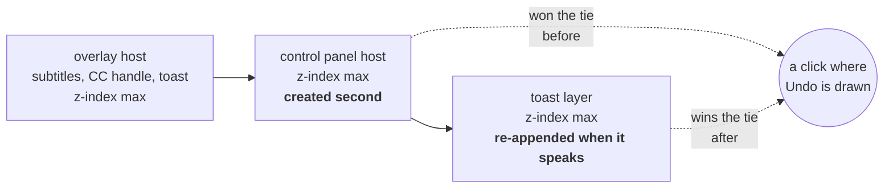
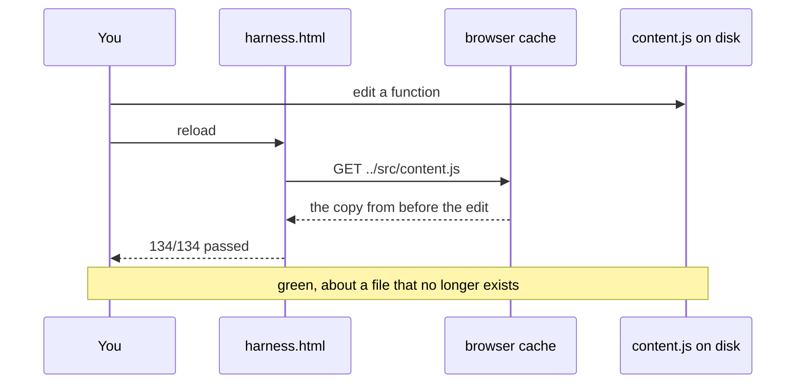

> [!TLDR]
> Ten defects, all fixed and verified. Three produce a **wrong answer** — a
> subtitle line that vanishes, one file in both boxes, an encoding heuristic one
> careless save from silence. Two produce something the reader **cannot use**.
> Five are **work nobody asked for**, the largest being a WebVTT copy built on
> every fetch and never read.
>
> - The most consequential finding is not in the extension. **The test harness
>   was reporting on a file that was no longer on disk**, so every green run
>   before today described the previous version.
> - The performance work is all on paths a viewer is on constantly: a mouse
>   move, an idle tab, a search. Nothing in the review changed what the tool does.
> - What is worth building next is a short list, and the top of it is **not a
>   feature** — it is making the aligner's answer available after attach.

## What was reviewed, and how {#scope}

The browser extension: roughly 8,500 lines across the content script, the
control panel, the study rail, the service worker and the subtitle pipeline.
The daemon, the translator and the viewer were **not** reviewed — they are
separate programs with their own tests, and mixing them into one pass would
have meant reading everything shallowly instead of one thing properly.

Three kinds of evidence, and the report says which one each finding rests on.
Reading code establishes that a mechanism exists; it does not establish that
anything happens. Where a defect could be triggered, it was triggered.

```oku-table
{"k": "table", "headers": ["Area", "How it was examined", "Evidence"], "rows": [["Cue lookup and rendering", "Read, then driven with a constructed overlapping file and probed at five moments", "Executed"], ["Auto-attach and result ranking", "Read, then reproduced in Node with an all-Turkish result set", "Executed"], ["Encoding detection", "Read, then re-checked against the four subtitles in the tree and a hand-made cp1254 file", "Executed"], ["The pointer and tick paths", "Instrumented querySelectorAll and getBoundingClientRect, counted over 600 dispatched movements and 2s of idle", "Measured"], ["The download cache", "Filled with 40 subtitles at 90KB and timed the calls a search makes", "Measured"], ["The control panel and toast", "Opened, positioned, and asked the document what a click at each control would hit", "Measured"], ["Study rail internals", "Read; the rank cache defect is a code path, and the round trip it causes was not timed", "Read only"], ["The daemon, subgen, srt-translator", "Not reviewed", "—"]]}
```

## Three wrong answers {#wrong}

### A line held over the dialogue under it disappeared

Cue lookup was a binary search over `start` and `end` together. That is exact
while lines do not overlap and wrong the moment they do: a sign, a lyric or a
caption held across speech puts a start out of order with the ends, so the
search follows the wrong half and never finds the line that is actually on
screen.

Constructed and run, because none of the four subtitle files in this tree has a
single overlapping pair — so this is a mechanism proven on a made case, not a
loss observed in your own viewing. Four cues, one held from 1s to 20s with
dialogue underneath it:

```oku-chart
{"k": "chart", "type": "range-bar", "title": "Four cues, and when each is on screen", "x_label": "seconds into the film", "ranges": [{"label": "HELD — a sign, held", "low": 1, "high": 20, "color": "warn"}, {"label": "dialogue A", "low": 2, "high": 4}, {"label": "dialogue B", "low": 5, "high": 7}, {"label": "next line", "low": 21, "high": 23}]}
```

At 3s and 6s the short lines are found, because a search over both fields
happens to land on them. Between 7s and 20s the held line is the only thing
covering the moment — and that is where it failed: at **9s and at 15s the
overlay showed nothing at all**, with ten seconds of the line still to run. The
reader sees a subtitle blink out mid-sentence and goes to check the timing.

The search is now over `start` alone — the field the file is sorted by, and the
only one a binary search can be trusted with — and whether a line covers the
moment is decided afterwards, by walking back a bounded number of cues. Where
two cover it, the one that started last wins: the newest thing said is the
thing being said. For a file with no overlaps the first candidate is the
answer and the walk stops immediately, so nothing changes for the ordinary case.

### Auto-attach could put one subtitle in both boxes

`pickBest` ranks by language before anything else, so the second slot is
normally chosen from the languages after your first preference. When the search
finds nothing at all in the first language, the best result falls through to the
second — and the old code then picked the same file again.

Reproduced in Node with a preference of `en,tr` and an entirely Turkish result
set: **file 11 in both slots**. On screen that is one subtitle drawn on top of
itself, which reads as the pair being broken rather than as English being
unavailable for this film. The second is now chosen from the languages the
first did not take, so a pair is two languages or it is one subtitle.

### The encoding heuristic was one careless save from silence

The class that detects a mangled decode held the **literal** U+0080 and U+009F
control characters. They are invisible in every editor. If a normalising save
ever dropped them the regex would still be valid and would match almost
nothing — so every mangled decode would score clean, the wrong encoding would
win, and Turkish subtitles would come out as mojibake with nothing in the code
looking wrong.

Written as escapes now. Checked after the change: a hand-made cp1254 file still
decodes as cp1254 and reads back as `Çok güzel değil mi şu İstanbul`, and all
four subtitles in the tree still decode as `utf-8-sig` with unchanged cue counts.

## Two things that could not be used {#unusable}

### The way back offered by a toast was buried under the panel

The toast lived in the overlay's shadow root, which carries the same z-index as
the control panel. **A tie at the same z-index is settled by document order**,
and the panel wins it by being created second.



Measured with the panel at the position and width it opens in: the Undo offered
when a second subtitle is lined up sat under the panel's left edge, and
`elementFromPoint` at the middle of that button returned the panel. The button
was drawn, described, and could not be pressed.

That is the ordinary case, not an edge of one. The panel is open every time this
toast appears, because attaching a second subtitle from the panel is how a pair
gets built.

The toast has a layer of its own now, put back on top every time it speaks.
Being last once is not a property that lasts: the panel, the study rail and any
open menu are all created after the overlay and re-parent themselves on going
fullscreen, so what matters is being last **at the moment of speaking**.

### The aligner reported a correction it had not made

With two subtitles cut to the same release — what a pair downloaded together
usually is — the aligner agrees with the file, changes nothing, and used to
announce `lined up matching the file`, with an Undo for the correction it had
not made. It now says `already in step` and offers nothing.

## Five costs nobody asked for {#waste}

None of these changes what the tool does. All of them are on paths a viewer is
on constantly.

```oku-chart
{"k": "chart", "type": "bar", "title": "What each cost is now, as a share of what it was (lower is better)", "y_label": "% of the previous cost", "rows": [{"label": "Forced layouts per mouse movement", "value": 12.5}, {"label": "Time per mouse movement", "value": 61.4}, {"label": "Idle DOM queries per second", "value": 10}, {"label": "Cache reads per search", "value": 8.4}, {"label": "WebVTT built per fetch", "value": 0}]}
```

```oku-table
{"k": "table", "headers": ["What", "Before", "After", "How it was measured"], "rows": [["Forced layouts, per mouse movement", "16", "2", "Counted getBoundingClientRect over 600 dispatched movement pairs, one video on the page"], ["Document video queries, per mouse movement", "2", "0.002", "Same run. Both pointermove and mousemove are listened for, so one physical movement asked twice"], ["Time, per mouse movement", "0.140 ms", "0.086 ms", "Same run, wall clock over the dispatch loop"], ["Idle document video queries, per second, per frame", "20", "2", "Counted over 2s on a page with no video, nothing attached"], ["WebVTT built per fetch", "85,421 chars in 3.7 ms", "none", "1,154-cue subtitle from this tree, timed in Node"], ["Cache work per search", "8.1 ms, 3.6 MB read", "0.68 ms, no blobs", "40 subtitles at 90KB in IndexedDB, timed in the browser"]]}
```

**The pointer path measured the whole page on every mouse move.** `pickVideo`
walks every `<video>` and measures each one, and measuring forces layout. The
answer to "which video is this page about" cannot change in a few milliseconds,
so it is kept for 250ms — well under the time it takes to move a hand to the CC
button.

**The idle tick ran at 20Hz with nothing to draw.** With nothing attached its
only remaining job is noticing that a player has appeared. This script runs in
**every frame of every page**, so a page with no video was running 20
document-wide queries a second for as long as the tab stayed open.

**Every fetch built a WebVTT copy nobody reads.** The overlay draws from `cues`
and there is no `<track>` anywhere in the extension. It was built on every
fetch — cache hits included — serialised across the worker-to-page message
boundary, and dropped. It is built on request now; the field stays available,
because the daemon's reply has it and parity between the two is the point.

**A search read every cached subtitle's bytes, twice.** Marking which results
are already held, and finding a held file for the same title, are both questions
about metadata — and both called the listing that loads blobs. The cost grows
with everything ever downloaded, in a service worker that is killed for holding
memory.

**The study rank cache closed instead of evicting.** At its limit it stopped
writing rather than dropping the oldest entry, so from that word on every line
paid a message round trip to the worker for words it had already asked about.
The round trip was not timed; the code path is plain.

## The finding that invalidates the others {#harness}

The harness loads its four sources by fixed URL. The browser's memory cache does
not revalidate a URL it has already seen in a session, and **the page URL is not
the script URL** — so reloading the harness reloaded the page and kept the
previous `content.js`.



Found by adding a counter to `tick()` and reading it from a failing assertion:
**undefined while the suite ran, a number the moment it finished**. The last
case re-injects the sources with a cache-buster of its own, so the only part of
the run that ever saw the current file was the moment after every assertion had
already been made.

Two consequences worth stating plainly:

1. **A fix verified against the previous version is not verified.** Today's
   suite runs were re-done from a clean origin after this was fixed. The
   pre-review code was then confirmed genuinely green — 134/134 — so the stale
   cache had not been hiding a real failure, at least not in the state the tree
   was in this morning.
2. **The page cannot fix this alone.** `harness.html` now cache-busts its own
   `<script src>` tags, but a page cannot defend what a module *imports*:
   `fallback.html` imports `provider.js`, which imports `cache.js`, a URL the
   page never names. `tests/serve.py` sends `Cache-Control: no-store` on every
   reply and is now the documented way to run the tests.

> [!IMPORTANT]
> This caught a regression I had introduced an hour earlier. The metadata index
> that made searches cheap was held until a write came through `cache.js` — which
> assumes that file is the only writer, and it is not: the store is one IndexedDB
> database reachable from every context of the extension. The fallback suite went
> from 22/22 to 20/22 by deleting a record directly, which is exactly what its two
> failing cases exist to model. The index is now checked against `getAllKeys`
> before it is trusted, which costs nothing and keeps the 0.68 ms.

## Found, and not fixed {#not-fixed}

Each of these is real. None was fixed, and the reason is given rather than
implied. The evidence column is the honest one: **read** means the mechanism is
in the code and was never triggered.

```oku-table
{"k": "table", "headers": ["What", "Consequence", "Evidence", "Why it was left"], "rows": [["The renderer draws one cue per track", "Where two lines genuinely overlap, one is dropped. The lookup now picks the later one deliberately rather than by accident, but the other is still not shown.", "Executed", "It is a design question, not a defect: two lines in one box needs a layout decision about which grows and where. Worth doing — see the next section."], ["A video, once picked, is never re-examined while it stays connected", "A page that swaps a small player for a large one keeps the small one. The tick only re-picks when the element disconnects.", "Read", "No case in the harness or in the four sites this is used on. Fixing it means re-running pickVideo periodically, which is the cost that was just removed."], ["Two attaches to the same slot can interleave", "attach() awaits the stored timing and the release memory. Two rapid attaches could apply the first one's offset to the second one's file.", "Read", "Every path that attaches awaits the previous one. Reachable only by driving the API directly, which is what the harness does and nothing else."], ["The search-cache key is truncated to 120 characters", "A query over ~100 characters pushes the season and episode off the end, so two episodes could share a cached search.", "Read", "Needs a title guess of 100+ characters. The daemon truncates identically, so changing one side alone would break the parity the two caches depend on."], ["The content script runs in every frame of every page", "Injection cost is paid per frame regardless of whether the frame has a video.", "Read", "The idle cost is now 2 queries per second per frame. Gating more work behind \"this frame has a video\" is a larger change than the remaining cost justifies."]]}
```

## What is worth doing next {#next}

This is the engineering list — what the code is ready for and what it is
missing. The product direction question is answered separately and at length in
[Beyond subtitles](beyond-subtitles.html); nothing here repeats it.

```oku-chart
{"k": "chart", "type": "scatter", "title": "Effort against value (top-left first)", "x_label": "Effort →", "y_label": "Value →", "series": [{"color": "accent", "label": "Timing", "data": [{"x": 2, "y": 9, "label": "Re-align on demand"}, {"x": 3, "y": 7, "label": "Drift warning"}, {"x": 5, "y": 6, "label": "Align against the audio"}]}, {"color": "warn", "label": "Reading", "data": [{"x": 3, "y": 8, "label": "Show both overlapping lines"}, {"x": 2, "y": 7, "label": "Pause at the end of a line"}, {"x": 4, "y": 6, "label": "A line the eye can follow"}]}, {"color": "success", "label": "Study", "data": [{"x": 3, "y": 8, "label": "Rank the whole file at attach"}, {"x": 5, "y": 7, "label": "Words-in-this-film count"}]}]}
```

### Timing

**Re-align on demand.** `autoAlign` already exists, already measures this file
against the one on screen, and is already exposed on the API — but it only runs
at attach, and only when the file has no timing of its own. There is no button
for "line these up now". That is the smallest gap between what the code can do
and what a reader can ask for, and it is the natural companion to the release
memory added this week: the memory is a guess from last time, and this is how
you correct it in one click when the guess is wrong.

**Drift warning.** A subtitle timed against a different framerate starts right
and ends minutes out. The rate control exists; nothing detects that it is
needed. Sampling the offset the aligner would compute at the start and again at
the two-thirds mark would say "this file is running slow" before an hour of
watching says it for you.

### Reading

**Show both lines when two genuinely overlap.** The lookup now chooses the later
one on purpose. Drawing both — the held line above, the dialogue below — is the
honest rendering and needs one layout decision.

**Pause at the end of a line.** The line keys added this week solve "say that
again". The other half of the same problem is not having to reach for anything:
stop at each line's end until a key is pressed. It is a natural pairing with
<kbd>T</kbd> and <kbd>Y</kbd>, and it is how the tools in this space are used
for intensive listening.

### Study

**Rank the whole file at attach.** Rarity is asked for line by line, over a
message to the worker, with a cache in front of it. A subtitle file is a
bounded vocabulary of a few thousand words — ranking all of it once at attach
removes the per-line round trip entirely and makes something new possible: a
count, before the film starts, of how many words in it you have not met.

## How to check any of this {#verify}

```bash
cd browser-extension
python3 tests/serve.py            # NOT python3 -m http.server — see above
# http://127.0.0.1:8997/tests/harness.html    136 cases, the overlay in a hostile page
# http://127.0.0.1:8997/tests/fallback.html    22 cases, fetching without the daemon

cd ../subtitle-daemon && uv run pytest        # the pipeline, both languages
```

Both pages run themselves and print a count. The two cases added by this review
are `a line still on screen is found when another one starts under it` and
`the way back offered by a toast is not buried under the panel` — the second
asks the *document* what a click at the button would hit, because the button's
own box reads the same either way, which is why no existing test could see it.

> [!NOTE]
> If a suite passes and you suspect it should not, check the origin before
> anything else. Serving the same tree on a different port is the quickest way
> to prove the browser is not answering from cache — that is how the numbers in
> this report were finally confirmed.

## Questions this raises {#faq}

**Was any of this making the tool visibly worse before today?**
Two of them, on the paths you use. The toast Undo being unclickable happens
every time a second subtitle is auto-aligned with the panel open. The
`lined up matching the file` sentence appears whenever a pair comes from the
same release. The overlapping-cue defect needs a file this tree does not
contain. The rest were costs, not symptoms.

**Is the performance work worth anything on a real machine?**
The honest answer is that the harness is a small page and the figures are a
lower bound: forcing layout costs more on a streaming page with a deep DOM than
it does here, and the idle tick's cost is paid per frame, in every tab, for as
long as the browser is open. What is measured is the count of operations
removed, which does not depend on the machine; the milliseconds do.

**Why one commit for ten fixes rather than ten?**
It was four, and two of them did not build on their own — the tick's new rate
landed in one commit and the constant it names in another. A history you cannot
bisect through is worse than one that is coarse, so they were collapsed into a
single verified commit. The harness fix stayed separate because it has to come
first to mean anything.

**What would have caught these earlier?**
The cache defect was caught by the second suite, which exists precisely because
the first one cannot see the fetch path. The stacking defect was caught by
asking the document a question no unit test asks — *what would a click here
hit*. The rest came from measuring rather than reading, which is the pattern:
every finding in the "wasted work" section was invisible to inspection and
obvious to a counter.
