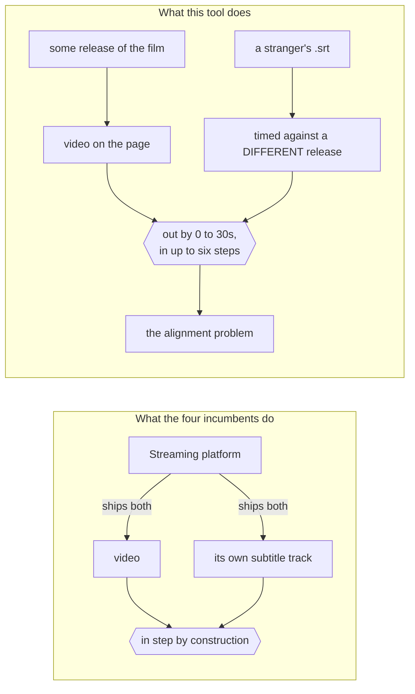

> [!TLDR]
> The product has a crowded market and four gates in front of it. The **research** has no competition at all, and it is the asset that does the thing you actually asked for - proving authority and attracting opportunities.
>
> - Four extensions already sell this, from $3.49 to $10 a month. Being the fifth is a distribution problem, not an engineering one.
> - The gate that binds first is the Chrome Web Store: *"We don't allow products or services that encourage, facilitate, or enable the unauthorized access, download, or streaming of copyrighted content or media."*
> - What nobody else has is the sync work. Every competitor consumes the streaming platform's own subtitles, which are already in step. This tool aligns arbitrary `.srt` files against arbitrary video, and now has a measured account of why that is hard.
> - **Recommendation: publish the research under your own name, keep the tool free and open, and let the tool be the credential rather than the revenue.** Revisit selling only if the writing finds an audience that asks for it.

This is a brief with a recommendation, not a business plan. Every claim that
rests on somebody else's terms carries its source; the one I could not verify
is marked as a gate rather than stated as a fact.

## What is in front of a buyer {#market}

Four products already do the thing a stranger would think this is - subtitles
on Netflix with word lookup and a deck.

```oku-table
{"headers":["Product","Price","What it is"],"rows":[["Migaku","$10/month, no free tier","The maximalist one. Full SRS, own parsing, strong Japanese focus."],["Trancy","$3.49 to $8.79/month","AI translation and immersion features, aggressive content marketing."],["Language Reactor","$4.99 to $6/month","The original Netflix dual-subtitle extension. Largest install base."],["This tool","-","Dual subtitles, study rail, word cards, deck, and the sync machinery none of them have."]]}
```

The prices are the useful part: **this is a $5-a-month market**. That sets the
arithmetic. A thousand paying users at $5 is $60k a year gross, and a thousand
paying users of a language-learning browser extension is not a small number -
it is a marketing achievement, reached after several thousand free ones. The
engineering is the part that is already done.

## What stands between the tool and a price {#gates}

Four things, in the order they bind.

```oku-step-flow
{"steps":[{"t":"The store's copyright policy","b":"Chrome Web Store, Malicious and Prohibited Products: \"We don't allow products or services that encourage, facilitate, or enable the unauthorized access, download, or streaming of copyrighted content or media.\" The extension itself is neutral - it draws text over any <video> element - but the listing, the screenshots and the reviews are what a reviewer reads. Every demo, every screenshot and every support thread would have to be Netflix, YouTube, Disney+ or a local file. The sites this was developed against cannot appear anywhere near it."},{"t":"The daemon","b":"A consumer will not run a Python process on 127.0.0.1:8791. This one is nearly solved already and it is worth knowing why: src/subtitles/local.js is the same pipeline in JavaScript and is what runs when the daemon is down, which is the ordinary case. The daemon is a development and diagnostic tool, not a dependency. Shipping means making that true on purpose - and test_js_parity.py already guards the two staying in step."},{"t":"Where the subtitles come from","b":"OpenSubtitles is metered: this project's own daemon tracks a per-day download budget and has spent 99 of it in a day more than once. A thousand users cannot share one key. The workable shapes are bring-your-own-key, which costs a signup step, or a commercial agreement. I could NOT verify their commercial terms - the site is behind Cloudflare and the API docs render in JavaScript - so treat this as a gate to clear before charging money rather than as a known blocker."},{"t":"Support","b":"The last one, and the one that ends side projects. A paid extension against six streaming sites that each redesign their player twice a year is a standing obligation. The frame model in browser-extension/CLAUDE.md exists because of exactly this class of breakage, and it was written for one user."}]}
```

## What is actually rare here {#rare}

Not the overlay. The sync.

Every competitor listed above reads the **streaming platform's own** subtitle
track. Those are already in step with the video, because the platform shipped
both. The hard problem does not arise for them and their machinery does not
address it.



The diagram is the whole of the argument: the two boxes on the right are not
connected by anything, and making them agree is the work. On the left there is
nothing to align.

This tool takes an arbitrary `.srt` from a stranger on the internet and puts it
against an arbitrary encode of a film, in two languages at once. That is a
different problem, and over the last week it produced things that are not
written down anywhere else:

- **The staircase.** Two releases of one television episode differ by six
  plateaus and five jumps totalling 30.55 seconds, measured twice over in two
  languages by different subtitlers. A confident aligner answers that pair with
  one number and is out by more than two seconds over 35 of 50 minutes.
  ([the measurement](sync-the-americans-2026-08-16.md))
- **A bake-off with controls.** Three alignment methods over a labelled corpus,
  scored by AUC and by recall at zero false accepts, with a null-transform
  control - and a headline that reversed when the corpus was doubled, recorded
  rather than quietly restated. ([the report](subtitle-sync-2026-08-13.md))
- **The MV3 frame model.** A cross-origin nested player, the top layer against
  hit-testing in fullscreen, and why a probe run inside the film's own frame
  reports a false pass. This is genuinely hard-won and the public writing on it
  is thin.

The first two are not really about subtitles. They are worked examples of
measuring something properly and then reporting against yourself when the
number moves - which is the thing a staff-level hiring conversation is trying
to establish and almost never can.

## Recommendation {#recommendation}

**Publish the research under your own name. Keep the tool free and open beside
it, as the evidence.** Sell nothing yet.

The reasoning, stated so you can disagree with it:

- The revenue ceiling is low and the marketing cost is high, in a market with
  four incumbents and a $5 price.
- The reputational ceiling is not low. "Here is why your subtitle sync tool is
  confidently wrong, and here is the measurement" is a post that engineers
  outside this niche will read, because the *method* transfers and the subject
  is concrete enough to hold attention.
- Publishing costs three evenings. Selling costs a year of support.
- The two are not exclusive in the wrong order: research first leaves selling
  open, selling first eats the time the writing needed.

### If you publish, three specifics {#specifics}

1. **Lead with the staircase, not with the tool.** The finding is the hook; the
   extension is the apparatus that produced it. A post that opens with "I built
   a Chrome extension" is one of ten thousand. One that opens with "the same
   episode, two releases, thirty seconds apart in five steps - and here is what
   that does to every subtitle sync tool" is one of one.
2. **Keep the demo material clean.** Netflix, YouTube, a local file, or the
   `srt-viewer` page with subtitles you own. Nothing in public should name the
   sites in this repo's test notes - not for the store's sake alone, but
   because it changes what the writing is about.
3. **Write it in your own voice.** The repo's commit style already strips every
   AI tell, for a different reason, and the same discipline applies here. The
   value of the artefact is that it demonstrates *your* judgement.

> [!NOTE]
> One thing this brief does not cover, because it is yours to weigh: anything
> public is public to colleagues too. The work is personal and on personal
> time, and nothing in it touches the day job - but the decision about how
> visible to be is not a technical one and I have not made it for you.

## What would change the recommendation {#reopen}

Stated up front so it is a trigger and not a mood:

- The writing lands and people ask where they can get it. Demand you did not
  manufacture is the signal worth acting on.
- OpenSubtitles turns out to have workable commercial terms, which removes gate
  three and takes bring-your-own-key off the onboarding path.
- The sync work reaches the point where it beats the incumbents on their own
  ground - a piecewise aligner that fixes the staircase automatically is a
  feature none of them can match, and it is the one thing here that would
  justify a price rather than a download.
