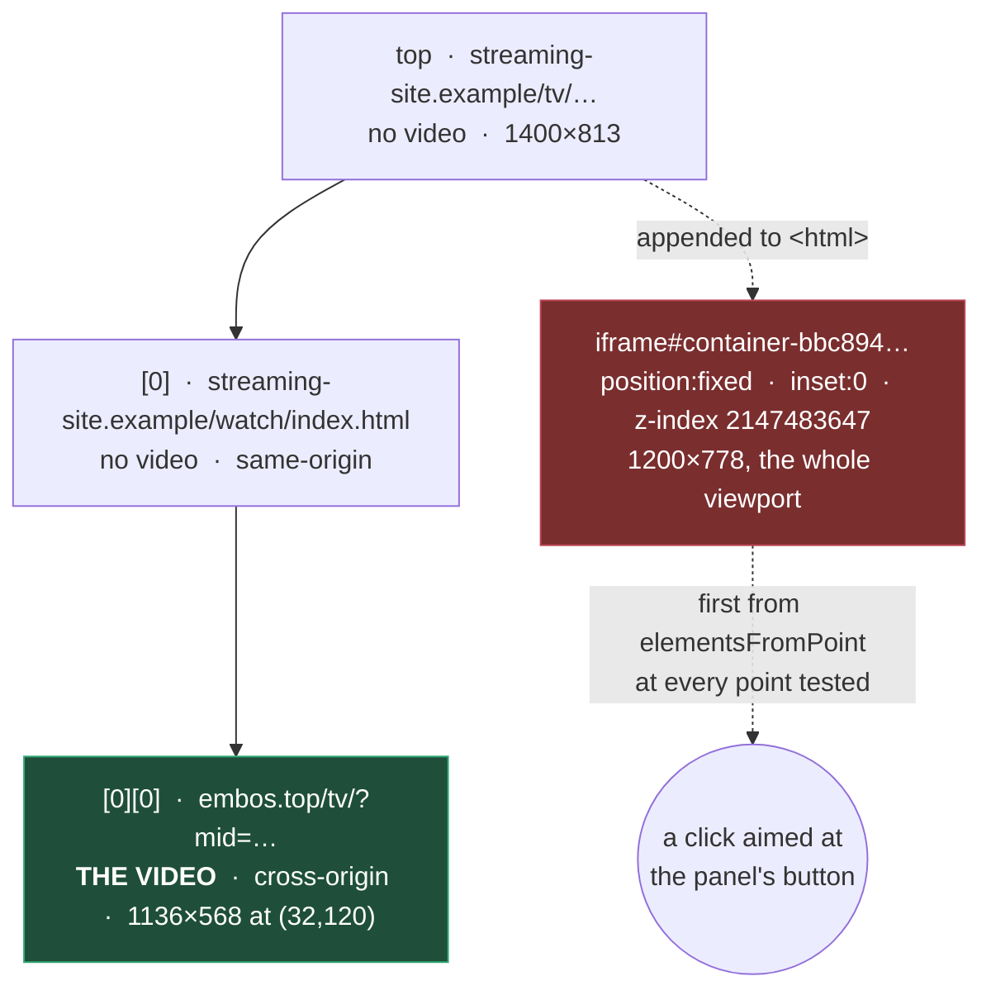

> [!TLDR]
> One thing is genuinely blocked on a decision, and it is the only defect here
> that a reader can hit in the middle of a film.
>
> - **The interactive chrome has no authority in the frame it is drawn in.** On
>   a site whose player is a cross-origin iframe, the panel and the study rail
>   are built two frames down, and anything the top page paints over that
>   iframe takes the click. Nothing inside the frame can change that — not
>   z-index, not the top layer.
> - It cannot be fixed without deciding **where the extension draws**. Three
>   options are compared below; the middle one keeps every site that works
>   today working exactly as it does.
> - The nine smaller items are all bounded and none of them is a wrong answer
>   on screen. Four are performance, three are honesty about state, two are
>   scale limits that need a second reader or a very long title to reach.

## The one that needs a decision {#frames}

### What was measured

On `streaming-site.example` the video is two frames down and cross-origin:



The extension builds its UI in whichever frame owns the `<video>`
(`onPointerMove` → `isPageSubject(pickVideoCached())` → `ensureOverlay()`), so
the CC handle, the panel and the study rail are all constructed inside
`embos.top` — a cross-origin iframe occupying about half the viewport.

### Why nothing inside that frame can fix it

Reproduced in a controlled page: an outer document, an iframe, and inside it a
shadow-root host promoted with `popover="manual"` + `showPopover()` — exactly
what `toTopLayer()` does.

```oku-table
{"k": "table", "headers": ["What the parent document paints", "Where the click landed"], "rows": [["nothing", "the in-iframe panel's button"], ["a plain `position:fixed; inset:0; z-index:2147483647` div appended to `<html>`", "**the parent's overlay**"]]}
```

The top layer is **per document**. Promoting a host inside the iframe raises it
above everything in *that* document and changes nothing about where the iframe
itself sits in its parent's paint order — the iframe is one box there. For
contrast, a host promoted the same way **in the top document** did out-rank the
site's ad iframe. The mechanism is the frame boundary, not z-index.

> [!IMPORTANT]
> The frame tree, the parent overlay and the platform behaviour above are all
> observed. What is **not** observed is the extension's own panel losing a click
> on that page: the site redirected the tab on the click needed to start
> playback, so the end-to-end run was never completed with the extension
> loaded. The mechanism is established; the specific interceptor in your own
> session — which has an ad blocker, and therefore a different set of
> overlays — is not.

### Telling in ten seconds whether you are hitting it

**Preconditions:** the panel is on screen and will not take a click, and you
can open devtools on the **top** frame (not the player's). In the console,
with the frame selector set to `top`:

```js
// x, y = the screen coordinates of a panel button that does nothing
document.elementsFromPoint(x, y).slice(0, 5)
    .map(e => e.tagName + (e.id ? '#' + e.id : '') + ' z=' + getComputedStyle(e).zIndex)
```

Three outcomes, and they mean different things:

```oku-table
{"k": "table", "headers": ["What comes back first", "What it means", "What helps"], "rows": [["An element belonging to the site (an ad iframe, a fullscreen overlay div)", "This defect. The click never reaches the player's frame at all.", "Nothing in the extension today. See the options below."], ["`IFRAME` that is the player", "The click reaches the player's frame; something inside it is taking the press.", "A different bug. Run the panel's own **Diagnose this page**, which hit-tests every button from inside that frame and names what covers it."], ["The extension's own host", "Nothing is in the way and the press is being lost after arrival.", "Also a different bug, and the diagnostic report is the right next step."]]}
```

### Three ways forward

The cue overlay is not in question — it has to track the picture, so it belongs
where the video is. What has to move is the interactive chrome: the CC handle,
the control panel, the study rail.

```oku-compare-grid
{"k": "compare-grid", "cards": [{"t": "Leave it", "accent": "warn", "verdict": "warn", "b": "Costs nothing and breaks nothing.\n\nWorks on every site where the video is in the top frame, and on nested sites whose parent paints nothing over the player.\n\n**But it fails silently**, and looks like the extension is broken rather than like the page is in the way. The reader's only route is the toolbar popup - which cannot be opened while the page is fullscreen, and fullscreen is when timing needs fixing."}, {"t": "Split by frame, always", "accent": "danger", "verdict": "bad", "b": "Cues stay in the video's frame; all chrome moves to the top frame.\n\nOne code path, so nothing is conditional and nothing can be right on one site and wrong on another.\n\n**But** every cue crosses a message boundary for the study rail, there are two clocks to keep from drifting, and it changes behaviour on the sites that work today - which is most of them."}, {"t": "Top-frame chrome, only when needed", "accent": "accent", "verdict": "good", "b": "Identical to today whenever the video's frame IS the top frame, which is every site that currently works.\n\nEngages only on a nested player, which is exactly the failing case - so the message plumbing lands on a path that is already broken and there is nothing to regress. `window.__ssoApi` is already the seam it runs along.\n\n**Costs** more branches, and a second arrangement to keep in the head."}]}
```

The third is the recommendation, and the reason is narrow: it confines a large
change to the case that is already failing. It is not free of new failure
modes, and these want naming before any of it is written:

```oku-step-flow
{"k": "step-flow", "ordered": true, "steps": [{"t": "Which frame is the top one, from inside a nested frame", "meta": "content.js", "b": "A frame cannot see its ancestors across an origin boundary. The service worker can address every frame of a tab and is already the thing that resolves this for page metadata, so it decides and tells each frame what it is."}, {"t": "Which video wins when a page has more than one", "meta": "an open question", "b": "Today each frame answers for itself and the one holding the subject video builds the UI. With the chrome in the top frame, something has to arbitrate - and a page with a player and a trailer is not rare."}, {"t": "A message per cue, or a local mirror", "meta": "the study rail", "b": "The rail marks words in the line currently on screen, so it needs the cue. Twenty times a second across a frame boundary is the naive version. A mirror of the cue list in the top frame with a clock correction is the other, and it is two clocks that can drift."}, {"t": "What the panel drags against", "meta": "geometry", "b": "The panel positions itself in viewport coordinates and counter-scales against whatever it is inside. In the top frame those are different coordinates from the player's box, and \"put the panel over the video\" stops being the identity transform."}, {"t": "Fullscreen, again", "meta": "the part that will bite", "b": "The whole fullscreen apparatus - top layer, then moving into the fullscreen element because hit-testing is by subtree - assumes the chrome and the fullscreened element are in one document. Fullscreen is requested by the frame that owns the video. This needs designing, not porting."}]}
```

## Nine smaller things left {#smaller}

None of these puts a wrong answer on screen. The evidence column is the honest
one: **read** means the mechanism is in the code and was never triggered.

```oku-table
{"k": "table", "headers": ["What", {"label": "Kind", "filter": "chips", "values": ["performance", "honesty", "scale", "test"]}, "Consequence", "Evidence", "Why it was left"], "rows": [["`status()` sweeps the document for `<video>` on every call", {"value": "performance", "values": ["performance"]}, "`pickVideoCached` was added to keep `pickVideo` off the pointer path; `status()` still calls the uncached `hasPlayableVideo()`, and panel.js calls `status()` from 33 sites. Measured: one document-wide sweep per call, five a second with the panel open and idle.", "Executed", "Small, and it is the same fix applied to one caller and not the rest - which is the pattern worth fixing properly rather than patching a second site."], ["The lookup cache in study.js has no bound", {"value": "performance", "values": ["performance"]}, "One entry per word per language pair for the life of the page. The rank cache beside it has a 20,000 limit and an eviction.", "Read", "Bounded in practice by a film's vocabulary. Listed for symmetry with its neighbour, not for urgency."], ["Hiding the subtitles does not survive the next attach", {"value": "honesty", "values": ["honesty"]}, "`attach()` sets `state.visible = true`. With per-site auto-attach on, a new episode turns them back on by itself.", "Executed", "A product question rather than a defect: an attach arguably SHOULD show what it just attached. Wanted your call before changing it."], ["The offset field's focus ring is its hover state", {"value": "honesty", "values": ["honesty"]}, "`input[type=number]:focus { outline: none }` suppresses the panel's shared 2px accent ring, and the more specific `.sso-sync__field:hover, :focus` sets the replacement to the hairline it already shows on hover. Measured at keyboard focus: outline none, border rgba(255,255,255,.11), background rgba(0,0,0,.25) - identical to hover.", "Executed", "One control, not a class - the search box does get an accent border. Changing it touches a rule written to make the field read as a number until you go near it, and that intent is worth preserving rather than overriding."], ["The search-cache key is truncated to 120 characters", {"value": "scale", "values": ["scale"]}, "A query over about 100 characters pushes the season and episode off the end, so two episodes could share a cached search.", "Read", "Needs a title guess of 100+ characters. Both sides truncate identically - `cache.js` here and `_cache_key` in the daemon's `server.py` - so it has to change in both at once or the two caches stop agreeing on a key."], ["A video, once picked, is never re-examined while it stays connected", {"value": "scale", "values": ["scale"]}, "A page that swaps a small player for a large one keeps the small one. The tick only re-picks when the element disconnects.", "Read", "No case in the harness or on the sites this is used on, and fixing it means re-running `pickVideo` periodically - the cost that was deliberately removed."], ["Two attaches to the same slot can interleave", {"value": "scale", "values": ["scale"]}, "`attach()` awaits the stored timing, so two rapid attaches could apply the first one's offset to the second one's file.", "Read", "Every path that attaches awaits the previous one. Reachable only by driving the API directly, which is what the harness does and nothing else."], ["The content script runs in every frame of every page", {"value": "performance", "values": ["performance"]}, "Four files, about 9,800 lines, parsed and executed per frame regardless of whether the frame has a video.", "Read", "The idle cost is two document queries a second per frame. Gating more behind \"this frame has a video\" is a larger change than the remaining cost justifies - and it is the same question the frame split above would answer properly."], ["The overlay suite is intermittently flaky under load", {"value": "test", "values": ["test"]}, "Two runs during this work failed a case each - \"CC handle opens the panel\" and \"subtitle size follows the picture\" - and passed on re-run with nothing changed.", "Executed", "One instance was diagnosed and fixed: a fixed 250ms sleep against a build that fetches two stylesheets, now a poll to a deadline. Whether the others share that shape was not established, and guessing at it would be retry-to-green."]]}
```

## Two things on the list that are not defects {#features}

Kept separate because they are work you might want, not things that are wrong.

```oku-table
{"k": "table", "headers": ["What", "What it would buy", "What it costs"], "rows": [["Rank the whole subtitle at attach", "Rarity is asked for line by line over a message to the worker, with a cache in front. A film is a bounded vocabulary of a few thousand words, so ranking it once at attach removes the per-line round trip entirely - and makes something new possible: a count, before the film starts, of how many words in it you have not met.", "One larger message at attach, and a decision about what to show when the language has no table."], ["A frequency table for a third language", "Study mode marks nothing outside English and Turkish. The rail now says so rather than staying silently empty, but saying so is not the same as working.", "The table is generated from the OpenSubtitles corpus by `tools/build-frequency.mjs`; adding a language is running it and shipping a quarter of a megabyte."]]}
```

## What this asks of you {#next}

Only one thing. Everything else on this page is either bounded and known, or
waiting on the same answer.

**Which of the three frame options.** The recommendation is the third —
top-frame chrome engaged only on a nested player — because it cannot regress
the sites that work today. It is still the largest single change the extension
has had, and the five questions above want answering on paper before any of it
is written.

If the answer is "leave it", that is a legitimate choice and the honest
follow-up is small: when the panel is drawn in a frame that is not the top one
**and** the top document has a full-viewport interceptor, say so on the panel
rather than letting it look broken. That is a diagnostic the extension already
has most of the parts for — `describeSurfaces()` reports what covers each
button from inside the frame, and what it cannot see is exactly the thing that
would need asking of the top frame through the worker.
