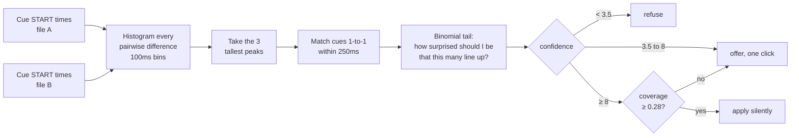
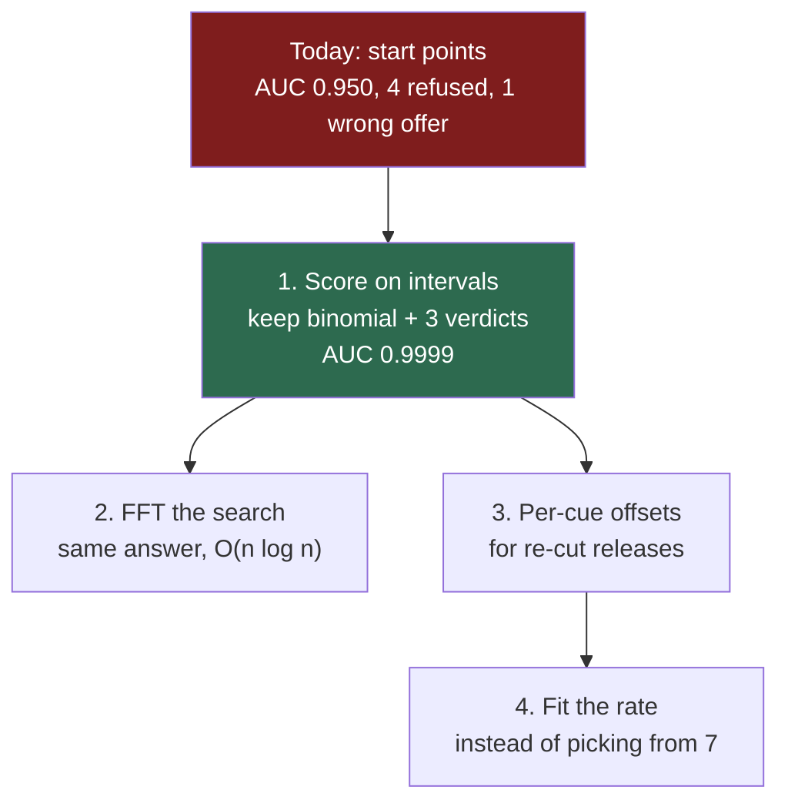

> [!TLDR]
> Our aligner votes on the difference between cue **start times**. Both published tools align **intervals** instead. Tested on our own 1,429 pairs, that one change lifts the ranking from AUC 0.950 to 0.9999 and recovers all four same-film pairs we currently refuse.
>
> - The decision framework — refuse / offer / apply — is sound and should be kept. It is the *evidence* underneath it that is thin.
> - A joint gate on interval correlation and peak prominence separated the corpus completely: 0 misses of 43 same-film pairs, 0 false accepts of 1,387. Tuned on one corpus, so treat it as a strong lead, not a settled constant.
> - Intervals do **not** fix a re-cut release. That needs a per-cue offset, which is what alass exists for, and it is a second change rather than the same one.

This is a **teaching document**: it is meant to be read start to finish, and it is ordered by the question you would ask next, not by topic. The measurements and their scripts are named as they arrive so any of them can be re-run.

## What does our aligner actually do? {#today}

`align.js` never looks at subtitle text. It works entirely from cue timings, which is what lets it match a Turkish subtitle to an English one.

The idea is that two files describing the same film describe the same speech, so the *difference* between a cue in one and its counterpart in the other is the same number over and over. Histogram every pairwise difference within ±3 minutes, and that number shows up as a peak.



Two parts of that are worth keeping whatever else changes.

**The binomial tail is the right question.** It asks "if these two files had nothing to do with each other, how surprised should I be that this many cues line up?" — which is exactly the question a gate needs to answer, and it accounts for file length. A long file gets more chances to line up by accident, and the binomial knows that.

**Three verdicts, not two.** The corpus has no threshold that accepts every true pair and rejects every false one. Splitting the decision means the razor-thin boundary decides between *refuse* and *ask*, which is the cheapest of the three places to be wrong.

## How well does it work? {#incumbent}

Measured over every pair of the 54 subtitle files in the repository — 1,429 judged pairs, of which 43 are the same film. The ground truth is derived from each download's own `movie_name`, not hand-labelled.

```oku-chart
{"type":"bar","title":"What the current aligner does with 1,429 pairs","x_label":"","y_label":"pairs","rows":[{"label":"Same film, shift applied silently","value":25},{"label":"Same film, offered for one click","value":13},{"label":"Same film, refused outright","value":4},{"label":"Different film, offered wrongly","value":1},{"label":"Different film, correctly refused","value":1386}]}
```

The safety property holds, and it is the one that matters most: **of 1,387 different-film pairs, none is ever shifted without asking.** The weakest thing the aligner applies on its own scores 23.17; the best score any wrong pair reaches anywhere in the corpus is 3.87. That is a factor of six, and every constant in the file is really guarding that margin.

The cost of that safety is recall. Thirteen genuine pairs need a click, and four are refused outright.

## Where does it fail, and why? {#failure}

All four refusals are the same failure, and it is not arithmetic — it is content.

*The Americans* burns English subtitles into the picture for the Russian dialogue. The English `.srt` is therefore **silent** through scenes that the Turkish `.srt` translates in full. Both files are the same episode; one of them simply has nothing to say for minutes at a time.

```oku-chart
{"type":"dot-plot","title":"Confidence: the four refusals against the one wrong acceptance","rows":[{"label":"3627520 | 8036211 — same film","value":-1.81,"color":"danger"},{"label":"12574878 | 3636803 — same film","value":-0.57,"color":"danger"},{"label":"3629320 | 8036211 — same film","value":-0.48,"color":"danger"},{"label":"3636803 | 9754858 — same film","value":2.18,"color":"danger"},{"label":"3629320 | 3629444 — DIFFERENT films","value":3.87,"color":"warn"}]}
```

*Position on the axis is the confidence; the dashed line the aligner needs to reach before it will even offer a shift is 3.5.* **The one wrong pair in the entire corpus (amber) sits further right than every same-film pair it refuses (red).** `3629320|3629444` is *The Americans* S02E02 against S02E01 — two different episodes, both Turkish — offered at confidence 3.87 with a 25.9 second shift.

That is the shape of the problem. It is not that the threshold is set badly; it is that this evidence puts a wrong pair above four right ones, so no threshold can separate them.

### Why start points are fragile here

A cue start is one instant. Whether two subtitlers agree on it depends on who starts speaking, how the line was split, and whether the scene was subtitled at all. When one file omits a scene, every start point in it is simply missing, and the vote loses those cues entirely.

An interval carries more. A cue that runs 2.4 seconds and its counterpart that runs 2.6 seconds still overlap for 2.4 seconds even if their starts disagree by 200ms — and that partial agreement is evidence the start-point vote throws away.

## What does the rest of the field do? {#field}

Two tools are the reference implementations, and they disagree with us on the same axis.

```oku-table
{"headers":["","ffsubsync","alass","ours"],"rows":[["What it compares","10ms speech/no-speech windows","time spans (start incl., end excl.)","cue start instants"],["Reference signal","video audio via WebRTC VAD, **or another .srt**","another subtitle file","another subtitle file"],["Search","FFT cross-correlation, O(n log n)","dynamic programming over spans","histogram vote, ±3 min window"],["Scoring","`(ref 1s ∧ sub 1s) − (ref 1s ∧ sub 0s)`","`overlap_scoring` or `standard_scoring`","binomial tail + coverage"],["Framerate","golden-section search (`--gss`)","`speed_optimization` parameter","7 fixed ratios, best wins"],["Variable offset","experimental `--split-penalty`","**yes — one offset per cue**","no, one global shift"],["Says no?","no explicit reject","no explicit reject","**yes, and that is the point**"]]}
```

Two observations matter more than the rest.

**Both of them align intervals; we align one endpoint of an interval.** ffsubsync discretises "is any subtitle on during this 10ms window" into a binary string. alass takes literal `TimeSpan` arrays. Neither uses bare start points.

**Neither of them refuses.** Both assume you have already decided the two files belong together, and answer "how far apart", never "are these the same film". Our three-verdict design has no counterpart in either, and it is the part of our system that protects a reader from a silently mis-shifted subtitle. **Do not trade it away for someone else's scoring function.**

> [!NOTE]
> ffsubsync's score is `(# ref 1s matched with sub 1s) − (# ref 1s matched with sub 0s)`, which expands to `2Σab − Σa`. Since `Σa` does not depend on the lag, its **argmax is identical to plain overlap** — the subtraction changes the reported number, not the chosen offset. The real difference from us is spans versus points, not the sign convention.

## So does it actually help us? {#experiment}

The repository already suspected this. `describeTrackForTrace` in `content.js` keeps cue ends "because the ends are what the aligner does not yet get". The ends have been recorded for weeks and nothing reads them.

So I ran it. Every file's cues become a binary occupancy signal at 100ms — ffsubsync's representation — and each pair is correlated by FFT. The score is the **Pearson correlation at the best lag**, normalised per lag by the region where the two files actually overlap, plus how far that peak stands above its own background.

> [!IMPORTANT]
> The first version of this experiment correlated the two signals **raw** and got a worse answer than the incumbent — 66 different-film pairs outscored the weakest genuine one. Two dense binary signals overlap about 80% of the time at *any* lag, so the raw product measures how talkative the two films are. Mean-subtraction and per-lag normalisation are not polish here; without them the measurement answers a different question. This project has been caught by exactly that bias once before, on the subtitle map.

```oku-chart
{"type":"scatter","title":"Every pair in the corpus, scored on spans","x_label":"Pearson correlation of the two occupancy signals at the best lag","y_label":"How far that peak stands above its own background (robust z)","series":[{"label":"Different film (1387)","color":"muted","data":[{"x":0.053,"y":2.1},{"x":0.092,"y":1.4},{"x":0.09,"y":1.8},{"x":0.391,"y":1.7},{"x":0.402,"y":1.5},{"x":0.3,"y":1.5},{"x":0.2,"y":1.2},{"x":0.336,"y":1.4},{"x":0.36,"y":1.5},{"x":0.442,"y":1.5},{"x":0.367,"y":2.6},{"x":0.269,"y":1.4},{"x":0.326,"y":1.2},{"x":0.367,"y":1.6},{"x":0.236,"y":1.9},{"x":0.346,"y":1.7},{"x":0.259,"y":1.4},{"x":0.361,"y":2.7},{"x":0.397,"y":1.7},{"x":0.121,"y":1.5},{"x":0.438,"y":1.5},{"x":0.279,"y":1.7},{"x":0.348,"y":1.7},{"x":0.308,"y":1.6},{"x":0.438,"y":1.4},{"x":0.436,"y":1.6},{"x":0.253,"y":1.3},{"x":0.355,"y":1.3},{"x":0.232,"y":1.4},{"x":0.334,"y":1.5},{"x":0.354,"y":1.8},{"x":0.353,"y":1.3},{"x":0.374,"y":1.6},{"x":0.289,"y":1.6},{"x":0.409,"y":1.5},{"x":0.24,"y":1.4},{"x":0.34,"y":1.2},{"x":0.343,"y":1.3},{"x":0.27,"y":1.3},{"x":0.216,"y":1.3},{"x":0.316,"y":2},{"x":0.348,"y":1.9},{"x":0.189,"y":1.6},{"x":0.28,"y":1.9},{"x":0.292,"y":2},{"x":0.308,"y":1.6},{"x":0.312,"y":1.7},{"x":0.101,"y":3.3},{"x":0.107,"y":3.6},{"x":0.077,"y":1.3},{"x":0.077,"y":1.6},{"x":0.114,"y":2.2},{"x":0.109,"y":2.3},{"x":0.063,"y":2.6},{"x":0.099,"y":2},{"x":0.27,"y":2.3},{"x":0.301,"y":1},{"x":0.265,"y":1.7},{"x":0.189,"y":1.8},{"x":0.219,"y":0.9},{"x":0.317,"y":3.6},{"x":0.313,"y":1.7},{"x":0.257,"y":1.5},{"x":0.267,"y":2.2},{"x":0.249,"y":1.5},{"x":0.286,"y":1.4},{"x":0.141,"y":3.1},{"x":0.269,"y":1.2},{"x":0.268,"y":1.4},{"x":0.237,"y":1.4},{"x":0.273,"y":2.4},{"x":0.117,"y":2.2},{"x":0.319,"y":1.1},{"x":0.228,"y":2},{"x":0.233,"y":1.5},{"x":0.244,"y":1.6},{"x":0.313,"y":1.1},{"x":0.302,"y":1.6},{"x":0.297,"y":2.3},{"x":0.292,"y":1.5},{"x":0.219,"y":1.7},{"x":0.22,"y":0.9},{"x":0.234,"y":1.7},{"x":0.258,"y":1.4},{"x":0.26,"y":1.6},{"x":0.244,"y":1.7},{"x":0.254,"y":2.4},{"x":0.213,"y":1.8},{"x":0.222,"y":1.5},{"x":0.234,"y":1.4},{"x":0.174,"y":1.1},{"x":0.186,"y":1.7},{"x":0.227,"y":1.6},{"x":0.214,"y":1.7},{"x":0.159,"y":5.6},{"x":0.226,"y":1.1},{"x":0.233,"y":1.7},{"x":0.239,"y":1.9},{"x":0.248,"y":1.5},{"x":0.103,"y":3},{"x":0.114,"y":2.9},{"x":0.085,"y":2.1},{"x":0.072,"y":3.3},{"x":0.139,"y":1.9},{"x":0.135,"y":1.9},{"x":0.084,"y":1.7},{"x":0.274,"y":2.5},{"x":0.237,"y":1},{"x":0.226,"y":1.3},{"x":0.134,"y":2.1},{"x":0.275,"y":1.5},{"x":0.208,"y":1.3},{"x":0.282,"y":1.7},{"x":0.301,"y":1.8},{"x":0.243,"y":1.3},{"x":0.259,"y":1.1},{"x":0.23,"y":1.3},{"x":0.197,"y":2.4},{"x":0.245,"y":1.6},{"x":0.205,"y":2},{"x":0.296,"y":1.9},{"x":0.276,"y":2.3},{"x":0.107,"y":2.5},{"x":0.25,"y":1},{"x":0.259,"y":1.3},{"x":0.293,"y":1.3},{"x":0.216,"y":1.3},{"x":0.248,"y":1},{"x":0.296,"y":2.1},{"x":0.23,"y":1.2},{"x":0.293,"y":1.7},{"x":0.153,"y":1.9},{"x":0.286,"y":1.5},{"x":0.285,"y":1.3},{"x":0.247,"y":1.5},{"x":0.287,"y":1.5},{"x":0.186,"y":1.6},{"x":0.235,"y":1.2},{"x":0.161,"y":2},{"x":0.241,"y":1.4},{"x":0.242,"y":1.5},{"x":0.228,"y":1.3},{"x":0.146,"y":2.1},{"x":0.217,"y":1.4},{"x":0.287,"y":1.4},{"x":0.16,"y":1.6},{"x":0.178,"y":2.1},{"x":0.18,"y":1.5},{"x":0.303,"y":1.7},{"x":0.25,"y":1.4},{"x":0.059,"y":2},{"x":0.06,"y":2.5},{"x":0.167,"y":2.1},{"x":0.154,"y":1.7},{"x":0.126,"y":1.1},{"x":0.122,"y":1.1},{"x":0.254,"y":1.5},{"x":0.21,"y":2.2},{"x":0.158,"y":1.4},{"x":0.106,"y":2.7},{"x":0.206,"y":2.3},{"x":0.27,"y":3.2},{"x":0.263,"y":1.1},{"x":0.143,"y":1.6},{"x":0.183,"y":1.4},{"x":0.184,"y":2.4},{"x":0.209,"y":4.2},{"x":0.144,"y":1.3},{"x":0.189,"y":3.6},{"x":0.171,"y":1.6},{"x":0.119,"y":1.4},{"x":0.251,"y":1.6},{"x":0.107,"y":2},{"x":0.247,"y":1.8},{"x":0.157,"y":1.4},{"x":0.19,"y":1.5},{"x":0.161,"y":1.5},{"x":0.253,"y":2},{"x":0.252,"y":1.2},{"x":0.152,"y":1.4},{"x":0.243,"y":2.8},{"x":0.11,"y":2.3},{"x":0.187,"y":1.9},{"x":0.156,"y":2.4},{"x":0.23,"y":2.2},{"x":0.187,"y":1.6},{"x":0.132,"y":1.9},{"x":0.296,"y":2.3},{"x":0.112,"y":2.1},{"x":0.24,"y":2.1},{"x":0.235,"y":2.3},{"x":0.193,"y":1.5},{"x":0.113,"y":2.3},{"x":0.183,"y":3.8},{"x":0.142,"y":2.3},{"x":0.158,"y":1.3},{"x":0.15,"y":1.3},{"x":0.193,"y":3.8},{"x":0.218,"y":2.1},{"x":0.202,"y":2.2},{"x":0.045,"y":1.9},{"x":0.045,"y":1.7},{"x":0.096,"y":1.7},{"x":0.108,"y":1.7},{"x":0.051,"y":1.9},{"x":0.05,"y":2},{"x":0.129,"y":3},{"x":0.144,"y":1.1},{"x":0.283,"y":2.1},{"x":0.085,"y":2.3},{"x":0.281,"y":3.8},{"x":0.16,"y":2.1},{"x":0.11,"y":1.9},{"x":0.207,"y":1.2},{"x":0.138,"y":3},{"x":0.122,"y":2.3},{"x":0.294,"y":4.7},{"x":0.092,"y":1.5},{"x":0.215,"y":3},{"x":0.11,"y":1.8},{"x":0.307,"y":1.6},{"x":0.094,"y":2.7},{"x":0.084,"y":2.1},{"x":0.105,"y":1.8},{"x":0.146,"y":1.2},{"x":0.102,"y":2.6},{"x":0.168,"y":2.2},{"x":0.204,"y":1.2},{"x":0.173,"y":2},{"x":0.248,"y":3.2},{"x":0.087,"y":2.2},{"x":0.148,"y":1.9},{"x":0.17,"y":2.8},{"x":0.139,"y":2.3},{"x":0.265,"y":1.8},{"x":0.268,"y":3},{"x":0.255,"y":2.5},{"x":0.192,"y":2.5},{"x":0.199,"y":2.8},{"x":0.175,"y":2.1},{"x":0.285,"y":2},{"x":0.109,"y":2},{"x":0.133,"y":1.6},{"x":0.207,"y":2.1},{"x":0.253,"y":3.8},{"x":0.106,"y":2.4},{"x":0.188,"y":2.6},{"x":0.146,"y":2.4},{"x":0.25,"y":3.2},{"x":0.252,"y":2.6},{"x":0.279,"y":1.3},{"x":0.298,"y":1.7},{"x":0.189,"y":1.2},{"x":0.194,"y":1.1},{"x":0.146,"y":2.3},{"x":0.199,"y":2.3},{"x":0.16,"y":2.5},{"x":0.246,"y":1.4},{"x":0.212,"y":1.5},{"x":0.187,"y":2},{"x":0.228,"y":1.7},{"x":0.192,"y":5.4},{"x":0.251,"y":1.6},{"x":0.259,"y":2.9},{"x":0.275,"y":1.6},{"x":0.183,"y":2.4},{"x":0.187,"y":2},{"x":0.115,"y":2.3},{"x":0.318,"y":2.3},{"x":0.122,"y":2},{"x":0.164,"y":2.2},{"x":0.15,"y":2.1},{"x":0.233,"y":1.7},{"x":0.229,"y":1.8},{"x":0.197,"y":2.2},{"x":0.18,"y":2.5},{"x":0.145,"y":2.4},{"x":0.18,"y":2.2},{"x":0.207,"y":4.3},{"x":0.243,"y":1.5},{"x":0.191,"y":2.9},{"x":0.255,"y":1.9},{"x":0.236,"y":3.7},{"x":0.236,"y":4.1},{"x":0.232,"y":4.4},{"x":0.299,"y":2.7},{"x":0.204,"y":2.2},{"x":0.175,"y":2.1},{"x":0.17,"y":1.8},{"x":0.197,"y":3.1},{"x":0.208,"y":3.1},{"x":0.203,"y":2.6},{"x":0.155,"y":1.4},{"x":0.188,"y":4.3},{"x":0.28,"y":0.9},{"x":0.261,"y":1.1},{"x":0.28,"y":1.7},{"x":0.301,"y":1.9},{"x":0.292,"y":2.8},{"x":0.297,"y":2.7},{"x":0.177,"y":3.7},{"x":0.093,"y":2.2},{"x":0.109,"y":2.3},{"x":0.068,"y":3},{"x":0.093,"y":2},{"x":0.099,"y":2.1},{"x":0.126,"y":1.3},{"x":0.134,"y":3.1},{"x":0.158,"y":3.3},{"x":0.127,"y":2.8},{"x":0.077,"y":2.7},{"x":0.119,"y":2.2},{"x":0.154,"y":1.2},{"x":0.249,"y":2.1},{"x":0.14,"y":1.6},{"x":0.058,"y":1.5},{"x":0.092,"y":2.2},{"x":0.14,"y":1.7},{"x":0.068,"y":2.7},{"x":0.099,"y":2},{"x":0.084,"y":2.3},{"x":0.144,"y":3.5},{"x":0.077,"y":2.1},{"x":0.087,"y":2.1},{"x":0.176,"y":2.8},{"x":0.125,"y":2},{"x":0.184,"y":4.8},{"x":0.095,"y":2.4},{"x":0.172,"y":4.4},{"x":0.156,"y":2.6},{"x":0.165,"y":2.6},{"x":0.136,"y":1.7},{"x":0.188,"y":3},{"x":0.071,"y":2.6},{"x":0.083,"y":2},{"x":0.139,"y":1.9},{"x":0.104,"y":3.3},{"x":0.071,"y":2.7},{"x":0.111,"y":1.2},{"x":0.168,"y":1.8},{"x":0.257,"y":2},{"x":0.232,"y":1.9},{"x":0.251,"y":1.4},{"x":0.272,"y":1.4},{"x":0.141,"y":1.2},{"x":0.145,"y":1.2},{"x":0.09,"y":1.3},{"x":0.21,"y":1.1},{"x":0.23,"y":1.3},{"x":0.073,"y":1.7},{"x":0.149,"y":3.7},{"x":0.106,"y":3.7},{"x":0.138,"y":2.2},{"x":0.18,"y":2},{"x":0.165,"y":3.9},{"x":0.184,"y":1.5},{"x":0.111,"y":1.1},{"x":0.276,"y":2.2},{"x":0.068,"y":1.4},{"x":0.175,"y":1.8},{"x":0.072,"y":3.5},{"x":0.105,"y":3.4},{"x":0.195,"y":3.3},{"x":0.155,"y":1.9},{"x":0.21,"y":1.3},{"x":0.18,"y":2.4},{"x":0.216,"y":1.5},{"x":0.083,"y":1.9},{"x":0.053,"y":1.9},{"x":0.172,"y":2.3},{"x":0.224,"y":2.6},{"x":0.201,"y":1.3},{"x":0.142,"y":2.4},{"x":0.155,"y":2.3},{"x":0.124,"y":2.7},{"x":0.147,"y":3.8},{"x":0.074,"y":1.9},{"x":0.168,"y":2.5},{"x":0.211,"y":2.6},{"x":0.119,"y":2.8},{"x":0.132,"y":1.1},{"x":0.162,"y":3.9},{"x":0.051,"y":1.9},{"x":0.048,"y":1.9},{"x":0.16,"y":1.4},{"x":0.154,"y":4.2},{"x":0.176,"y":1},{"x":0.179,"y":1},{"x":0.123,"y":3.3},{"x":0.155,"y":2.5},{"x":0.129,"y":2.5},{"x":0.206,"y":1.7},{"x":0.144,"y":1.6},{"x":0.131,"y":3.4},{"x":0.142,"y":2.6},{"x":0.121,"y":2.2},{"x":0.176,"y":3.6},{"x":0.16,"y":1.8},{"x":0.072,"y":2},{"x":0.222,"y":2.1},{"x":0.126,"y":2.5},{"x":0.156,"y":2.2},{"x":0.147,"y":2.8},{"x":0.093,"y":1.9},{"x":0.123,"y":2.2},{"x":0.154,"y":2.2},{"x":0.147,"y":2.3},{"x":0.094,"y":2.6},{"x":0.085,"y":1.7},{"x":0.177,"y":2.1},{"x":0.137,"y":1.7},{"x":0.119,"y":2.4},{"x":0.085,"y":1.5},{"x":0.099,"y":2.5},{"x":0.105,"y":1.9},{"x":0.115,"y":1.2},{"x":0.113,"y":1.2},{"x":0.249,"y":1.1},{"x":0.105,"y":1.4},{"x":0.114,"y":2.5},{"x":0.171,"y":2},{"x":0.17,"y":3.9},{"x":0.177,"y":4},{"x":0.112,"y":2},{"x":0.145,"y":1.9},{"x":0.12,"y":1.3},{"x":0.198,"y":2.2},{"x":0.19,"y":2.1},{"x":0.253,"y":1.4},{"x":0.23,"y":1.3},{"x":0.196,"y":1.4},{"x":0.201,"y":1.4},{"x":0.146,"y":2.1},{"x":0.112,"y":2},{"x":0.194,"y":2.3},{"x":0.148,"y":1.5},{"x":0.127,"y":3.1},{"x":0.159,"y":1.5},{"x":0.124,"y":2},{"x":0.087,"y":1.9},{"x":0.148,"y":3.8},{"x":0.289,"y":3.8},{"x":0.232,"y":2.2},{"x":0.232,"y":1.8},{"x":0.049,"y":2.1},{"x":0.086,"y":2.6},{"x":0.114,"y":2.3},{"x":0.237,"y":2.1},{"x":0.155,"y":2.3},{"x":0.163,"y":2.4},{"x":0.202,"y":1.8},{"x":0.173,"y":1.3},{"x":0.104,"y":2.9},{"x":0.126,"y":2.9},{"x":0.158,"y":2.6},{"x":0.143,"y":1.8},{"x":0.213,"y":1.4},{"x":0.191,"y":1.2},{"x":0.132,"y":2.4},{"x":0.147,"y":2.4},{"x":0.216,"y":3},{"x":0.219,"y":1.2},{"x":0.068,"y":2},{"x":0.111,"y":2.3},{"x":0.182,"y":1.3},{"x":0.187,"y":3.1},{"x":0.1,"y":2.1},{"x":0.224,"y":1.5},{"x":0.14,"y":2},{"x":0.268,"y":2.7},{"x":0.25,"y":2.6},{"x":0.315,"y":1},{"x":0.318,"y":2.3},{"x":0.19,"y":1},{"x":0.197,"y":1},{"x":0.082,"y":2.1},{"x":0.202,"y":1.6},{"x":0.099,"y":1.6},{"x":0.142,"y":3.3},{"x":0.188,"y":2.4},{"x":0.104,"y":2.5},{"x":0.136,"y":2.5},{"x":0.069,"y":2.4},{"x":0.168,"y":2.1},{"x":0.318,"y":1.4},{"x":0.196,"y":2},{"x":0.136,"y":1.7},{"x":0.128,"y":1.6},{"x":0.063,"y":2.4},{"x":0.191,"y":1.9},{"x":0.193,"y":1.7},{"x":0.192,"y":1.4},{"x":0.182,"y":1.4},{"x":0.163,"y":2.4},{"x":0.102,"y":3.3},{"x":0.127,"y":2.2},{"x":0.119,"y":3.3},{"x":0.207,"y":1.5},{"x":0.123,"y":2.1},{"x":0.216,"y":1.6},{"x":0.124,"y":2},{"x":0.13,"y":2.1},{"x":0.181,"y":1.1},{"x":0.237,"y":1.3},{"x":0.136,"y":2.2},{"x":0.088,"y":3.1},{"x":0.175,"y":2.4},{"x":0.144,"y":2.3},{"x":0.153,"y":2.2},{"x":0.195,"y":1.8},{"x":0.119,"y":2.5},{"x":0.203,"y":1},{"x":0.187,"y":1},{"x":0.325,"y":1.5},{"x":0.231,"y":1.4},{"x":0.281,"y":1},{"x":0.286,"y":1},{"x":0.141,"y":2.2},{"x":0.075,"y":2},{"x":0.115,"y":2},{"x":0.166,"y":1.7},{"x":0.126,"y":2.3},{"x":0.153,"y":2.5},{"x":0.117,"y":2},{"x":0.175,"y":1},{"x":0.179,"y":2.1},{"x":0.218,"y":1.9},{"x":0.237,"y":2.1},{"x":0.106,"y":2.7},{"x":0.193,"y":2.2},{"x":0.114,"y":2.6},{"x":0.199,"y":2.8},{"x":0.138,"y":1.9},{"x":0.057,"y":1.9},{"x":0.129,"y":2.4},{"x":0.183,"y":1.5},{"x":0.086,"y":3.3},{"x":0.161,"y":2.9},{"x":0.082,"y":1.8},{"x":0.101,"y":1.8},{"x":0.069,"y":1.5},{"x":0.088,"y":2.5},{"x":0.081,"y":2.7},{"x":0.374,"y":1.5},{"x":0.088,"y":1.6},{"x":0.089,"y":1.2},{"x":0.187,"y":1.4},{"x":0.205,"y":2.7},{"x":0.146,"y":2.1},{"x":0.091,"y":1.5},{"x":0.183,"y":1.6},{"x":0.064,"y":2.2},{"x":0.225,"y":1.9},{"x":0.2,"y":1.7},{"x":0.272,"y":1.3},{"x":0.35,"y":3.3},{"x":0.267,"y":1.7},{"x":0.272,"y":1.6},{"x":0.21,"y":1.7},{"x":0.173,"y":2.3},{"x":0.098,"y":1.7},{"x":0.153,"y":2.2},{"x":0.08,"y":2.4},{"x":0.149,"y":1.3},{"x":0.206,"y":1.2},{"x":0.284,"y":1.5},{"x":0.196,"y":1.6},{"x":0.153,"y":4},{"x":0.157,"y":3.3},{"x":0.087,"y":1.8},{"x":0.208,"y":1.7},{"x":0.201,"y":1.5},{"x":0.211,"y":1.2},{"x":0.093,"y":3.8},{"x":0.166,"y":1.9},{"x":0.129,"y":3.2},{"x":0.176,"y":1.7},{"x":0.153,"y":2.9},{"x":0.151,"y":4.2},{"x":0.214,"y":1.9},{"x":0.115,"y":4.1},{"x":0.159,"y":1.8},{"x":0.173,"y":1.9},{"x":0.244,"y":3.5},{"x":0.181,"y":3},{"x":0.174,"y":2.2},{"x":0.121,"y":2.2},{"x":0.113,"y":2.2},{"x":0.169,"y":4.3},{"x":0.179,"y":2.1},{"x":0.177,"y":1.2},{"x":0.184,"y":1.9},{"x":0.169,"y":1.1},{"x":0.178,"y":1.3},{"x":0.231,"y":1},{"x":0.261,"y":1.2},{"x":0.219,"y":1.6},{"x":0.224,"y":1.5},{"x":0.229,"y":2.6},{"x":0.246,"y":7.6},{"x":0.169,"y":3},{"x":0.059,"y":2.2},{"x":0.16,"y":1.3},{"x":0.144,"y":3},{"x":0.252,"y":3.1},{"x":0.074,"y":2.6},{"x":0.12,"y":2.9},{"x":0.096,"y":1.9},{"x":0.126,"y":1.3},{"x":0.074,"y":2.5},{"x":0.118,"y":1.7},{"x":0.114,"y":3.2},{"x":0.227,"y":2.2},{"x":0.112,"y":2},{"x":0.095,"y":1.3},{"x":0.134,"y":1.7},{"x":0.162,"y":3.5},{"x":0.08,"y":1.4},{"x":0.183,"y":3.3},{"x":0.135,"y":3},{"x":0.192,"y":1.2},{"x":0.113,"y":4.2},{"x":0.207,"y":1.8},{"x":0.133,"y":1.8},{"x":0.187,"y":2.2},{"x":0.031,"y":2},{"x":0.21,"y":2.2},{"x":0.192,"y":1.9},{"x":0.198,"y":3.7},{"x":0.162,"y":3.4},{"x":0.252,"y":1.2},{"x":0.247,"y":1.5},{"x":0.144,"y":1.1},{"x":0.149,"y":1.1},{"x":0.104,"y":2.6},{"x":0.092,"y":1.4},{"x":0.195,"y":2.9},{"x":0.131,"y":2.6},{"x":0.187,"y":3.6},{"x":0.202,"y":1.8},{"x":0.085,"y":2.2},{"x":0.081,"y":1.8},{"x":0.137,"y":3.2},{"x":0.212,"y":2},{"x":0.132,"y":3},{"x":0.081,"y":2.4},{"x":0.132,"y":2.1},{"x":0.111,"y":2.7},{"x":0.099,"y":2.8},{"x":0.076,"y":2},{"x":0.188,"y":2.9},{"x":0.136,"y":2.1},{"x":0.109,"y":3.1},{"x":0.139,"y":3.9},{"x":0.105,"y":1.5},{"x":0.168,"y":2.2},{"x":0.171,"y":2.1},{"x":0.293,"y":2.4},{"x":0.136,"y":1.7},{"x":0.098,"y":2.8},{"x":0.142,"y":2.4},{"x":0.11,"y":1.5},{"x":0.25,"y":1.5},{"x":0.212,"y":2.3},{"x":0.225,"y":2.6},{"x":0.213,"y":2.4},{"x":0.372,"y":2},{"x":0.312,"y":1.3},{"x":0.241,"y":2.1},{"x":0.246,"y":2},{"x":0.145,"y":3.1},{"x":0.104,"y":3.1},{"x":0.167,"y":1.7},{"x":0.294,"y":4},{"x":0.096,"y":1.5},{"x":0.283,"y":3.2},{"x":0.073,"y":2},{"x":0.092,"y":2.5},{"x":0.158,"y":2.9},{"x":0.294,"y":3.3},{"x":0.173,"y":2.2},{"x":0.132,"y":1.8},{"x":0.135,"y":1.9},{"x":0.152,"y":2.3},{"x":0.137,"y":2.5},{"x":0.128,"y":1.3},{"x":0.198,"y":3.9},{"x":0.203,"y":1.3},{"x":0.168,"y":2.4},{"x":0.193,"y":1.3},{"x":0.163,"y":2.2},{"x":0.223,"y":4.5},{"x":0.219,"y":4.5},{"x":0.157,"y":2.1},{"x":0.178,"y":2},{"x":0.017,"y":2.5},{"x":0.137,"y":1.8},{"x":0.127,"y":3.7},{"x":0.027,"y":3},{"x":0.198,"y":1.5},{"x":0.224,"y":6.9},{"x":0.07,"y":1.6},{"x":0.068,"y":2.2},{"x":0.209,"y":2},{"x":0.18,"y":1.8},{"x":0.201,"y":1.6},{"x":0.205,"y":1.6},{"x":0.081,"y":1.7},{"x":0.165,"y":3},{"x":0.103,"y":1.7},{"x":0.175,"y":2.5},{"x":0.212,"y":1.6},{"x":0.082,"y":2.1},{"x":0.096,"y":2.1},{"x":0.136,"y":3.1},{"x":0.206,"y":1.5},{"x":0.101,"y":2.3},{"x":0.088,"y":2.4},{"x":0.154,"y":2},{"x":0.114,"y":3.5},{"x":0.097,"y":3},{"x":0.064,"y":1.6},{"x":0.156,"y":3.5},{"x":0.126,"y":2.8},{"x":0.134,"y":4.6},{"x":0.123,"y":2.1},{"x":0.123,"y":2.2},{"x":0.17,"y":3.1},{"x":0.162,"y":3.2},{"x":0.271,"y":2.2},{"x":0.16,"y":2.7},{"x":0.092,"y":1.8},{"x":0.14,"y":2.6},{"x":0.075,"y":1.3},{"x":0.221,"y":1.1},{"x":0.178,"y":2.4},{"x":0.22,"y":2.6},{"x":0.206,"y":2.3},{"x":0.358,"y":2.1},{"x":0.343,"y":1.6},{"x":0.214,"y":1.8},{"x":0.219,"y":1.8},{"x":0.158,"y":2.6},{"x":0.195,"y":2.8},{"x":0.172,"y":1.8},{"x":0.176,"y":3.5},{"x":0.197,"y":2.8},{"x":0.206,"y":2.9},{"x":0.097,"y":3},{"x":0.179,"y":3.6},{"x":0.126,"y":2.5},{"x":0.127,"y":2.5},{"x":0.164,"y":2.2},{"x":0.193,"y":1.6},{"x":0.13,"y":2.8},{"x":0.097,"y":2.2},{"x":0.071,"y":1.6},{"x":0.216,"y":4.6},{"x":0.18,"y":2},{"x":0.073,"y":1.3},{"x":0.185,"y":1.4},{"x":0.055,"y":1.9},{"x":0.068,"y":1.9},{"x":0.261,"y":1.8},{"x":0.184,"y":1.1},{"x":0.122,"y":2},{"x":0.116,"y":3.3},{"x":0.09,"y":3.1},{"x":0.153,"y":2.7},{"x":0.154,"y":2.3},{"x":0.08,"y":1.5},{"x":0.14,"y":2.3},{"x":0.121,"y":2},{"x":0.286,"y":2.3},{"x":0.252,"y":3.1},{"x":0.269,"y":1.8},{"x":0.274,"y":1.7},{"x":0.116,"y":1.8},{"x":0.157,"y":1},{"x":0.174,"y":2.3},{"x":0.174,"y":2.2},{"x":0.197,"y":2.5},{"x":0.119,"y":2.5},{"x":0.187,"y":2.3},{"x":0.098,"y":2.9},{"x":0.126,"y":1.6},{"x":0.077,"y":1.9},{"x":0.085,"y":1.1},{"x":0.177,"y":1.9},{"x":0.204,"y":1.4},{"x":0.185,"y":1.7},{"x":0.217,"y":2.5},{"x":0.097,"y":1.1},{"x":0.169,"y":3.5},{"x":0.096,"y":1.1},{"x":0.189,"y":2},{"x":0.18,"y":1.6},{"x":0.397,"y":1.8},{"x":0.125,"y":1.1},{"x":0.105,"y":1.7},{"x":0.214,"y":1.4},{"x":0.187,"y":2},{"x":0.151,"y":1.7},{"x":0.119,"y":2.2},{"x":0.169,"y":1.5},{"x":0.15,"y":1.4},{"x":0.192,"y":1.5},{"x":0.163,"y":1.3},{"x":0.226,"y":1.2},{"x":0.303,"y":4.8},{"x":0.253,"y":1.8},{"x":0.257,"y":1.8},{"x":0.294,"y":1.6},{"x":0.106,"y":3.1},{"x":0.081,"y":1.9},{"x":0.101,"y":1.7},{"x":0.16,"y":1.3},{"x":0.104,"y":2.6},{"x":0.17,"y":2.1},{"x":0.205,"y":1.2},{"x":0.168,"y":2.2},{"x":0.233,"y":3},{"x":0.069,"y":1.9},{"x":0.128,"y":1.8},{"x":0.165,"y":2.4},{"x":0.145,"y":2.2},{"x":0.261,"y":1.9},{"x":0.261,"y":2.7},{"x":0.244,"y":2.3},{"x":0.2,"y":2.4},{"x":0.194,"y":2.5},{"x":0.186,"y":2.2},{"x":0.274,"y":2},{"x":0.121,"y":2.7},{"x":0.131,"y":1.9},{"x":0.219,"y":2},{"x":0.244,"y":4},{"x":0.129,"y":3.1},{"x":0.18,"y":2.5},{"x":0.146,"y":2.3},{"x":0.247,"y":2.9},{"x":0.248,"y":2.4},{"x":0.286,"y":1.3},{"x":0.294,"y":1.8},{"x":0.192,"y":1.2},{"x":0.197,"y":1.2},{"x":0.339,"y":2.2},{"x":0.229,"y":1.9},{"x":0.255,"y":2},{"x":0.241,"y":2.1},{"x":0.344,"y":2.5},{"x":0.293,"y":1.4},{"x":0.274,"y":2.1},{"x":0.227,"y":1.5},{"x":0.086,"y":1.1},{"x":0.213,"y":2},{"x":0.298,"y":1.3},{"x":0.21,"y":1.9},{"x":0.232,"y":1.9},{"x":0.117,"y":1.2},{"x":0.221,"y":2.3},{"x":0.088,"y":1.2},{"x":0.222,"y":1.6},{"x":0.221,"y":1.7},{"x":0.211,"y":1.3},{"x":0.084,"y":1.3},{"x":0.191,"y":2.5},{"x":0.295,"y":1.5},{"x":0.129,"y":1.3},{"x":0.135,"y":1.4},{"x":0.195,"y":2.7},{"x":0.29,"y":1.5},{"x":0.246,"y":3.6},{"x":0.074,"y":1.5},{"x":0.068,"y":1.4},{"x":0.199,"y":4.1},{"x":0.188,"y":3.4},{"x":0.09,"y":1.7},{"x":0.086,"y":1.6},{"x":0.089,"y":1.7},{"x":0.145,"y":2.3},{"x":0.131,"y":1.6},{"x":0.193,"y":2},{"x":0.193,"y":1.8},{"x":0.214,"y":2.5},{"x":0.138,"y":2.2},{"x":0.13,"y":2.5},{"x":0.185,"y":2.4},{"x":0.131,"y":3.3},{"x":0.167,"y":1.4},{"x":0.128,"y":1.7},{"x":0.249,"y":2.3},{"x":0.189,"y":2.5},{"x":0.159,"y":2.8},{"x":0.149,"y":2.9},{"x":0.284,"y":3.9},{"x":0.192,"y":2},{"x":0.114,"y":2.1},{"x":0.153,"y":1.5},{"x":0.217,"y":3.4},{"x":0.229,"y":4.2},{"x":0.113,"y":1.8},{"x":0.169,"y":2.7},{"x":0.081,"y":2.8},{"x":0.335,"y":1.7},{"x":0.313,"y":1.7},{"x":0.277,"y":1.1},{"x":0.324,"y":1.9},{"x":0.325,"y":4},{"x":0.331,"y":3.8},{"x":0.053,"y":1.8},{"x":0.097,"y":2},{"x":0.131,"y":1.6},{"x":0.136,"y":4.2},{"x":0.111,"y":2.2},{"x":0.1,"y":3},{"x":0.149,"y":2.3},{"x":0.142,"y":3.1},{"x":0.108,"y":3},{"x":0.099,"y":2.4},{"x":0.091,"y":2.6},{"x":0.04,"y":2.2},{"x":0.074,"y":3.4},{"x":0.082,"y":2.3},{"x":0.099,"y":2.6},{"x":0.196,"y":1.7},{"x":0.102,"y":4},{"x":0.108,"y":2.3},{"x":0.131,"y":2.6},{"x":0.073,"y":2},{"x":0.26,"y":4},{"x":0.119,"y":2.2},{"x":0.129,"y":2.4},{"x":0.106,"y":2.9},{"x":0.251,"y":1.9},{"x":0.23,"y":1.6},{"x":0.256,"y":1.3},{"x":0.294,"y":1.4},{"x":0.178,"y":1.1},{"x":0.174,"y":1.1},{"x":0.089,"y":2.3},{"x":0.135,"y":2.1},{"x":0.133,"y":1.7},{"x":0.151,"y":3.1},{"x":0.101,"y":2.2},{"x":0.098,"y":2.8},{"x":0.149,"y":2.5},{"x":0.125,"y":2.1},{"x":0.127,"y":2},{"x":0.126,"y":1.8},{"x":0.093,"y":1.8},{"x":0.056,"y":2.9},{"x":0.12,"y":3.9},{"x":0.126,"y":2.1},{"x":0.125,"y":2.1},{"x":0.183,"y":1.7},{"x":0.113,"y":3.1},{"x":0.126,"y":3.1},{"x":0.127,"y":2.2},{"x":0.066,"y":1.6},{"x":0.254,"y":4.3},{"x":0.102,"y":2.3},{"x":0.157,"y":2.4},{"x":0.088,"y":2.1},{"x":0.261,"y":1.6},{"x":0.239,"y":1.4},{"x":0.317,"y":1.3},{"x":0.31,"y":1.3},{"x":0.19,"y":1.2},{"x":0.195,"y":1.2},{"x":0.141,"y":1.9},{"x":0.068,"y":2.5},{"x":0.098,"y":2.2},{"x":0.084,"y":2.2},{"x":0.143,"y":3.3},{"x":0.078,"y":1.9},{"x":0.073,"y":1.8},{"x":0.182,"y":2.8},{"x":0.13,"y":2.1},{"x":0.196,"y":4.7},{"x":0.104,"y":2.4},{"x":0.167,"y":3.8},{"x":0.154,"y":2.5},{"x":0.17,"y":2.8},{"x":0.124,"y":1.8},{"x":0.205,"y":2.8},{"x":0.082,"y":2.8},{"x":0.075,"y":2.3},{"x":0.136,"y":1.8},{"x":0.115,"y":3.5},{"x":0.078,"y":2.7},{"x":0.1,"y":1.1},{"x":0.162,"y":1.7},{"x":0.246,"y":2},{"x":0.229,"y":2.1},{"x":0.236,"y":1.2},{"x":0.25,"y":1.3},{"x":0.128,"y":1.2},{"x":0.132,"y":1.2},{"x":0.191,"y":2},{"x":0.204,"y":2.1},{"x":0.221,"y":2.7},{"x":0.129,"y":2.3},{"x":0.123,"y":2.1},{"x":0.181,"y":2.5},{"x":0.132,"y":3},{"x":0.167,"y":1.5},{"x":0.113,"y":1.9},{"x":0.254,"y":2.3},{"x":0.177,"y":2.8},{"x":0.159,"y":2.7},{"x":0.15,"y":2.8},{"x":0.271,"y":3.6},{"x":0.169,"y":1.9},{"x":0.121,"y":2.3},{"x":0.164,"y":1.7},{"x":0.232,"y":3.3},{"x":0.223,"y":3.9},{"x":0.114,"y":2},{"x":0.176,"y":2.9},{"x":0.087,"y":3},{"x":0.345,"y":1.9},{"x":0.324,"y":1.8},{"x":0.259,"y":1},{"x":0.308,"y":2.1},{"x":0.332,"y":4.2},{"x":0.338,"y":4.1},{"x":0.193,"y":1.6},{"x":0.189,"y":1.5},{"x":0.181,"y":1.6},{"x":0.169,"y":2.2},{"x":0.129,"y":3.3},{"x":0.127,"y":1.6},{"x":0.107,"y":3},{"x":0.196,"y":1.3},{"x":0.132,"y":1.9},{"x":0.196,"y":1.5},{"x":0.155,"y":2.1},{"x":0.15,"y":1.9},{"x":0.179,"y":1},{"x":0.217,"y":1.2},{"x":0.128,"y":2.1},{"x":0.116,"y":2.9},{"x":0.176,"y":2.2},{"x":0.152,"y":2.9},{"x":0.135,"y":2.1},{"x":0.183,"y":1.9},{"x":0.127,"y":2.2},{"x":0.206,"y":1},{"x":0.194,"y":1},{"x":0.325,"y":1.6},{"x":0.226,"y":1.3},{"x":0.301,"y":1.1},{"x":0.306,"y":1.1},{"x":0.218,"y":1.7},{"x":0.138,"y":3.3},{"x":0.106,"y":2.2},{"x":0.148,"y":1.9},{"x":0.106,"y":2.5},{"x":0.135,"y":2.8},{"x":0.187,"y":2.9},{"x":0.182,"y":1.7},{"x":0.136,"y":2.7},{"x":0.094,"y":2.6},{"x":0.099,"y":2.5},{"x":0.275,"y":3},{"x":0.212,"y":2.5},{"x":0.108,"y":2.2},{"x":0.159,"y":2.4},{"x":0.134,"y":2.1},{"x":0.212,"y":3.4},{"x":0.106,"y":2.3},{"x":0.162,"y":1.2},{"x":0.09,"y":2.2},{"x":0.142,"y":1.1},{"x":0.158,"y":1.5},{"x":0.214,"y":1},{"x":0.204,"y":1.1},{"x":0.208,"y":1.9},{"x":0.213,"y":1.8},{"x":0.196,"y":1.6},{"x":0.14,"y":2.5},{"x":0.144,"y":1.6},{"x":0.185,"y":2.8},{"x":0.174,"y":3.7},{"x":0.182,"y":1.4},{"x":0.18,"y":1.6},{"x":0.185,"y":1.2},{"x":0.205,"y":2.4},{"x":0.196,"y":2.5},{"x":0.274,"y":1.2},{"x":0.231,"y":1.4},{"x":0.1,"y":1.8},{"x":0.137,"y":1.5},{"x":0.173,"y":2},{"x":0.236,"y":2.5},{"x":0.1,"y":1.3},{"x":0.187,"y":1.4},{"x":0.169,"y":1.3},{"x":0.177,"y":1.5},{"x":0.274,"y":1.6},{"x":0.276,"y":2.2},{"x":0.247,"y":0.9},{"x":0.252,"y":0.9},{"x":0.11,"y":2.7},{"x":0.045,"y":2.1},{"x":0.119,"y":2.2},{"x":0.206,"y":3.4},{"x":0.136,"y":1.2},{"x":0.144,"y":3.1},{"x":0.126,"y":2.7},{"x":0.162,"y":1.9},{"x":0.094,"y":2.2},{"x":0.055,"y":1.9},{"x":0.135,"y":2.1},{"x":0.242,"y":2.6},{"x":0.105,"y":2.3},{"x":0.119,"y":1.4},{"x":0.128,"y":3.3},{"x":0.062,"y":1.4},{"x":0.062,"y":1.6},{"x":0.186,"y":1.6},{"x":0.185,"y":4.1},{"x":0.207,"y":1.1},{"x":0.21,"y":1.1},{"x":0.153,"y":1.7},{"x":0.119,"y":3.2},{"x":0.113,"y":2.4},{"x":0.104,"y":2.5},{"x":0.084,"y":2.4},{"x":0.101,"y":2.6},{"x":0.081,"y":1.9},{"x":0.076,"y":2},{"x":0.225,"y":1},{"x":0.098,"y":2},{"x":0.124,"y":2.1},{"x":0.153,"y":1.9},{"x":0.143,"y":3.5},{"x":0.132,"y":3.1},{"x":0.111,"y":1.8},{"x":0.15,"y":2.3},{"x":0.088,"y":1.5},{"x":0.205,"y":2.4},{"x":0.182,"y":2},{"x":0.282,"y":1.6},{"x":0.269,"y":1.4},{"x":0.189,"y":1.6},{"x":0.194,"y":1.5},{"x":0.13,"y":2.5},{"x":0.142,"y":2.8},{"x":0.079,"y":2.2},{"x":0.13,"y":3.5},{"x":0.031,"y":1.4},{"x":0.118,"y":2.5},{"x":0.119,"y":2.5},{"x":0.24,"y":2.3},{"x":0.085,"y":2.1},{"x":0.083,"y":1.9},{"x":0.143,"y":1.2},{"x":0.081,"y":1.9},{"x":0.07,"y":2.3},{"x":0.181,"y":2.4},{"x":0.146,"y":2.6},{"x":0.272,"y":3.6},{"x":0.255,"y":3.5},{"x":0.221,"y":2},{"x":0.241,"y":1.8},{"x":0.188,"y":1.6},{"x":0.192,"y":1.6},{"x":0.148,"y":2},{"x":0.134,"y":3},{"x":0.165,"y":2.3},{"x":0.116,"y":1.6},{"x":0.192,"y":1},{"x":0.184,"y":2},{"x":0.188,"y":2.7},{"x":0.118,"y":2},{"x":0.219,"y":3.2},{"x":0.096,"y":1.8},{"x":0.148,"y":2},{"x":0.192,"y":1.6},{"x":0.145,"y":3.2},{"x":0.143,"y":2.9},{"x":0.322,"y":1.4},{"x":0.255,"y":1},{"x":0.162,"y":1.1},{"x":0.167,"y":1.1},{"x":0.172,"y":2.7},{"x":0.141,"y":1.4},{"x":0.246,"y":3.3},{"x":0.198,"y":4.6},{"x":0.187,"y":3.7},{"x":0.252,"y":3.6},{"x":0.222,"y":2.2},{"x":0.115,"y":2.6},{"x":0.172,"y":2.3},{"x":0.136,"y":1.8},{"x":0.194,"y":3.1},{"x":0.103,"y":2.2},{"x":0.176,"y":1.7},{"x":0.151,"y":2.6},{"x":0.165,"y":1.5},{"x":0.136,"y":1.6},{"x":0.281,"y":1.2},{"x":0.221,"y":1.2},{"x":0.261,"y":2.4},{"x":0.267,"y":2.4},{"x":0.204,"y":1.4},{"x":0.129,"y":3.2},{"x":0.143,"y":3.7},{"x":0.185,"y":1.8},{"x":0.149,"y":5},{"x":0.125,"y":3.1},{"x":0.15,"y":1.7},{"x":0.201,"y":2.8},{"x":0.147,"y":4.1},{"x":0.146,"y":1.2},{"x":0.106,"y":3.5},{"x":0.139,"y":2.4},{"x":0.117,"y":2.4},{"x":0.184,"y":1.2},{"x":0.201,"y":3.3},{"x":0.208,"y":1.1},{"x":0.211,"y":1.1},{"x":0.175,"y":1.5},{"x":0.165,"y":3.1},{"x":0.156,"y":2.3},{"x":0.262,"y":3.6},{"x":0.205,"y":1.3},{"x":0.074,"y":2.7},{"x":0.119,"y":2.8},{"x":0.261,"y":1.7},{"x":0.137,"y":1.6},{"x":0.106,"y":2.7},{"x":0.257,"y":1.4},{"x":0.182,"y":4.7},{"x":0.257,"y":2.1},{"x":0.231,"y":2},{"x":0.286,"y":1.2},{"x":0.282,"y":2.4},{"x":0.227,"y":1.1},{"x":0.233,"y":1.1},{"x":0.145,"y":2.7},{"x":0.144,"y":2.2},{"x":0.14,"y":2},{"x":0.117,"y":2.2},{"x":0.047,"y":1.5},{"x":0.16,"y":2},{"x":0.211,"y":2.1},{"x":0.107,"y":1.8},{"x":0.13,"y":1.1},{"x":0.141,"y":2.8},{"x":0.082,"y":1.9},{"x":0.083,"y":2.2},{"x":0.195,"y":1.9},{"x":0.177,"y":4.8},{"x":0.206,"y":1.1},{"x":0.209,"y":1.1},{"x":0.168,"y":1.3},{"x":0.153,"y":1.8},{"x":0.198,"y":2.4},{"x":0.115,"y":2.1},{"x":0.201,"y":3.2},{"x":0.072,"y":1.9},{"x":0.162,"y":2.1},{"x":0.21,"y":1.9},{"x":0.187,"y":3.3},{"x":0.155,"y":2.8},{"x":0.314,"y":1.4},{"x":0.325,"y":1.3},{"x":0.159,"y":1.1},{"x":0.164,"y":1.1},{"x":0.179,"y":1.2},{"x":0.164,"y":1.9},{"x":0.211,"y":3},{"x":0.119,"y":2.2},{"x":0.22,"y":3.4},{"x":0.075,"y":1.9},{"x":0.165,"y":2.3},{"x":0.201,"y":1.9},{"x":0.175,"y":3.2},{"x":0.144,"y":2.7},{"x":0.293,"y":1.2},{"x":0.308,"y":1.2},{"x":0.159,"y":1.2},{"x":0.164,"y":1.2},{"x":0.133,"y":2.6},{"x":0.285,"y":3.9},{"x":0.236,"y":2.3},{"x":0.141,"y":3},{"x":0.265,"y":1.4},{"x":0.288,"y":4.2},{"x":0.215,"y":1.6},{"x":0.182,"y":1.2},{"x":0.125,"y":1.4},{"x":0.098,"y":1.8},{"x":0.19,"y":2.9},{"x":0.158,"y":1.5},{"x":0.239,"y":1.5},{"x":0.242,"y":1.4},{"x":0.145,"y":3.1},{"x":0.097,"y":2.3},{"x":0.164,"y":2.8},{"x":0.21,"y":1.9},{"x":0.133,"y":2.7},{"x":0.144,"y":1.1},{"x":0.169,"y":2.9},{"x":0.058,"y":1.9},{"x":0.046,"y":1.8},{"x":0.172,"y":1.5},{"x":0.167,"y":4.8},{"x":0.179,"y":1},{"x":0.182,"y":1},{"x":0.082,"y":2.3},{"x":0.013,"y":1.4},{"x":0.129,"y":1.8},{"x":0.21,"y":1.5},{"x":0.203,"y":2},{"x":0.169,"y":3.8},{"x":0.163,"y":2.7},{"x":0.325,"y":4},{"x":0.264,"y":2.7},{"x":0.175,"y":1.6},{"x":0.179,"y":1.6},{"x":0.142,"y":1.3},{"x":0.085,"y":1.8},{"x":0.081,"y":2.7},{"x":0.194,"y":3},{"x":0.115,"y":2.5},{"x":0.237,"y":2.9},{"x":0.232,"y":3.2},{"x":0.203,"y":1.9},{"x":0.268,"y":2.4},{"x":0.208,"y":1.5},{"x":0.212,"y":1.5},{"x":0.104,"y":2.1},{"x":0.05,"y":2},{"x":0.227,"y":1.5},{"x":0.187,"y":2.1},{"x":0.062,"y":1.8},{"x":0.061,"y":2.2},{"x":0.201,"y":2.7},{"x":0.145,"y":1.6},{"x":0.172,"y":1.3},{"x":0.175,"y":1.4},{"x":0.16,"y":2.2},{"x":0.186,"y":3.2},{"x":0.065,"y":1.4},{"x":0.157,"y":1.9},{"x":0.147,"y":2},{"x":0.315,"y":4.1},{"x":0.291,"y":5.4},{"x":0.293,"y":2.7},{"x":0.297,"y":2.6},{"x":0.196,"y":1.4},{"x":0.207,"y":2.4},{"x":0.159,"y":3.7},{"x":0.16,"y":3.7},{"x":0.306,"y":3.5},{"x":0.247,"y":2.4},{"x":0.153,"y":1.4},{"x":0.156,"y":1.4},{"x":0.163,"y":1.5},{"x":0.172,"y":1},{"x":0.177,"y":1.1},{"x":0.206,"y":1.6},{"x":0.233,"y":2.2},{"x":0.295,"y":1.5},{"x":0.3,"y":1.5},{"x":0.136,"y":2.5},{"x":0.124,"y":2.4},{"x":0.3,"y":1.3},{"x":0.266,"y":1.3},{"x":0.107,"y":1},{"x":0.112,"y":1},{"x":0.068,"y":1.9},{"x":0.052,"y":1.6},{"x":0.063,"y":1.8},{"x":0.065,"y":1.8},{"x":0.058,"y":1.8},{"x":0.052,"y":2.2},{"x":0.062,"y":1.4},{"x":0.061,"y":1.4},{"x":0.13,"y":2.1},{"x":0.13,"y":2.1},{"x":0.155,"y":5.9},{"x":0.155,"y":5.9}]},{"label":"Same film (43)","color":"accent","data":[{"x":0.866,"y":22.7},{"x":0.798,"y":10.8},{"x":0.779,"y":11},{"x":0.962,"y":18.1},{"x":0.598,"y":12.8},{"x":0.493,"y":10.9},{"x":0.8,"y":19},{"x":0.928,"y":27},{"x":0.917,"y":16},{"x":0.845,"y":10},{"x":0.927,"y":26.4},{"x":0.881,"y":8.4},{"x":0.883,"y":8.6},{"x":0.425,"y":5},{"x":0.522,"y":7.4},{"x":0.662,"y":9.2},{"x":0.719,"y":5.3},{"x":0.498,"y":9.2},{"x":0.425,"y":8.4},{"x":0.442,"y":9.1},{"x":0.487,"y":10.5},{"x":0.493,"y":7.3},{"x":0.525,"y":8.2},{"x":0.57,"y":7.3},{"x":0.966,"y":17.6},{"x":0.776,"y":17.5},{"x":0.557,"y":5.2},{"x":0.449,"y":10},{"x":0.647,"y":18.7},{"x":0.545,"y":12.7},{"x":0.543,"y":13},{"x":0.544,"y":9.5},{"x":0.609,"y":10.3},{"x":0.528,"y":7.2},{"x":0.511,"y":15.3},{"x":0.734,"y":19.4},{"x":0.752,"y":13.3},{"x":0.523,"y":6.9},{"x":0.629,"y":8.9},{"x":0.815,"y":14.6},{"x":0.769,"y":16.1},{"x":0.676,"y":7.8},{"x":0.998,"y":12.5}]}]}
```

*Each dot is one pair of subtitle files. The two clouds barely overlap on either axis alone — same-film correlation runs 0.425 to 0.998 and different-film tops out at 0.442 — but no horizontal or vertical line separates them. An L-shaped boundary does.*

```oku-chart
{"type":"bar","title":"Ranking quality over the same 1,429 pairs (ROC AUC, 1.0 is perfect)","x_label":"","y_label":"AUC","rows":[{"label":"Spans — Pearson correlation","value":0.99986},{"label":"Spans — peak prominence","value":0.99954},{"label":"Start points — confidence (today)","value":0.94989},{"label":"Start points — coverage (today)","value":0.92351}]}
```

AUC is the honest headline because nothing was tuned to produce it: it is a ranking measure over the same pairs and the same ground truth. **0.950 to 0.9999.**

And the five pairs the current aligner gets wrong all move the right way:

```oku-table
{"headers":["Pair","Truth","Today: confidence → verdict","On spans: r / prominence"],"rows":[["3627520 | 8036211","same","−1.81 → refused","**0.425 / 8.4**"],["12574878 | 3636803","same","−0.57 → refused","**0.425 / 5.0**"],["3629320 | 8036211","same","−0.48 → refused","**0.493 / 7.3**"],["3636803 | 9754858","same","2.18 → refused","**0.528 / 7.2**"],["3629320 | 3629444","**different**","3.87 → offered","**0.081 / 1.7**"]]}
```

The wrong pair, which today outranks all four right ones, falls to the bottom.

### Does the shift it finds actually land?

A high correlation with a wrong offset would be useless. Checked against the 25 pairs the incumbent applies on its own — the best ground truth available:

- **21 of 25 agree within 250ms**, median disagreement **40ms**.
- The 4 that disagree are all files that were *retimed or re-cut*, where a single global shift is not well defined in the first place. The worst is 5.2 seconds, on a pair of Turkish retimings of the same episode.

That concentration is the answer to the next question, and it is not a good one for spans.

### A joint gate separates the corpus completely

```oku-insight
{"b":"r ≥ 0.295 AND prominence ≥ 4.9 — misses 0 of 43 same-film pairs, admits 0 of 1,387 different-film pairs."}
```

Both conditions are needed. The hardest negatives are five pairs involving one file that reach r ≈ 0.44 — above the weakest genuine pair — but with prominence of only 1.4 to 1.6, because their correlation is broad and flat near the edge of the search window. A real match is a *spike*; a coincidence is a *slope*.

> [!WARNING]
> Those two constants were chosen by grid search **on the corpus they are evaluated on**, with 43 positive examples. Perfect separation under those conditions is a lead, not a proven constant. The AUC above is the number that did not involve tuning. Before shipping thresholds, hold out films the search never saw.

## What to change, and in what order {#candidates}



**1 — Score on intervals, keep everything else.** The largest measured win and the smallest conceptual change. Cue ends are already stored, already mirrored across the frame gap, and already unused. The decision framework, the coverage gate and the three verdicts stay exactly as they are; only the evidence they consume changes. The binomial needs re-deriving for overlap rather than counts, which is the real work.

**2 — FFT the offset search.** Not a quality change. The current two-pointer vote is `O(n·m)` over the window; an FFT correlation is `O(n log n)` and would make the wide 25-minute pass cost roughly what the narrow one does today. Worth doing *after* 1, because 1 changes what is being correlated.

**3 — Per-cue offsets for re-cut releases.** This is the one intervals do **not** solve, and my own experiment shows why: the known different-cut pair `3637194|8036186` scores r = 0.471 with prominence 9.3 and would **pass the joint gate above**, applying a single shift where the true divergence runs from +1.3s to +21s. Today that pair is excluded by a hand-maintained list. alass solves it properly with a dynamic program that emits one offset per cue and a `split_penalty` (0–1000, default 7, useful range 5–20) controlling how willingly it introduces a break.

**4 — Fit the framerate instead of selecting it.** We try 7 fixed ratios. ffsubsync searches the ratio continuously with golden-section search. Lowest priority: the fixed set covers the ratios that actually occur, and the current comment explains that a free fit needs a constant-offset peak to seed it, which a rate error destroys.

### Should we just use alass?

`alass-core` is a Rust crate whose only dependency is `rand`, and it is dev-only — so it compiles to WebAssembly, which an MV3 extension can load. Its API is a direct fit: `align(reference: &[TimeSpan], list: &[TimeSpan], split_penalty, speed_optimization, score_fn) -> (Vec<TimeDelta>, f64)`.

The reason not to reach for it first is the one from the table above: **alass has no notion of refusing.** It returns the best alignment of whatever it is given, including two unrelated films. Everything this project has learned about not silently mis-shifting a subtitle lives in the layer alass does not have. Adopting it means keeping our gate and using alass only *after* the gate has said yes — which is a sensible destination, and a reason to do candidate 1 first rather than instead.

## What I could not settle {#limits}

Stated plainly, because a report that hides these is worse than no report.

- **The thresholds are tuned on the evaluation corpus.** Grid search over two parameters against 43 positives. The AUC is untuned; the perfect separation is not.
- **The corpus is narrow.** 54 files, and 42 of the 43 same-film pairs are *The Americans*. A finding about cross-language subtitle behaviour drawn almost entirely from one show is a finding about that show until a second one is added.
- **The interval experiment is a prototype, not our aligner.** It reimplements the representation and scoring; it does not run through `align.js`'s rate hypotheses, trimming, injective matching or peak-guard logic. Numbers will move when it is done properly inside the real pipeline.
- **The audio route is unverified.** ffsubsync's strongest mode aligns against the video's own audio, which would need no reference subtitle at all. Whether a content script can read samples from a cross-origin `<video>` — the CORS tainting question — I could not confirm from a primary source in this session, and I am not willing to assert a negative I have not executed. Settling it costs one experiment: attach `createMediaElementSource` to a player on a real site and look at whether the samples are non-zero.
- **`--split-penalty` in ffsubsync is marked experimental** by its own README; alass's equivalent is the documented main path. If candidate 3 happens, alass is the better reference.

## Frequently asked next questions {#faq}

```oku-info-tip
{"summary": "Why not just compare the subtitle text instead of the timings?", "content": ["Because the two files are in different languages, which is the whole point of the tool. Text matching works for the retimed-same-language case, which is the easy case that timing already handles. `sc0ty/subsync` takes this route by running speech recognition on the audio and matching the recognised words to the subtitle text — it buys language independence at the cost of a speech model, and it still needs the audio."]}
```

```oku-info-tip
{"summary": "Would this have prevented the wrong shift reported on The Americans?", "content": ["That case is already prevented, by the coverage gate — a shift that pairs no better than chance is never applied on its own. The interval change addresses the other half of the same problem: the four pairs where the honest answer was available and the aligner could not see it. The synthetic scene-blanking test in `test_align.py` should be re-run against any interval implementation, because occupancy is exactly what blanking removes."]}
```

```oku-info-tip
{"summary": "How would I re-run these measurements?", "content": ["The experiment is `spans2.mjs` in this session's scratchpad; it reads the download cache and `srt-viewer/subtitles` directly and writes every pair's score to `/tmp/spanpairs2.json`. The incumbent's numbers come from driving `align.js` over the same pairs, which is what `subtitle-daemon/tests/test_align.py` now does — its fixtures derive the ground truth from each file's sidecar, so both halves of the comparison share one definition of 'the same film'."]}
```

## Sources {#sources}

- [kaegi/alass](https://github.com/kaegi/alass) — README: split penalty, `--no-splits`, framerate handling
- [alass-core on docs.rs](https://docs.rs/alass-core/latest/alass_core/) — `align`, `align_nosplit`, `overlap_scoring`, `standard_scoring`, `TimeSpan`; read directly
- [smacke/ffsubsync](https://github.com/smacke/ffsubsync) — README: the three-step algorithm, FFT scoring, `--gss`, `--vad`, the limitations section; read directly
- [pums974/srtsync](https://github.com/pums974/srtsync) — named by ffsubsync as the same approach; not read
- [sc0ty/subsync](https://github.com/sc0ty/subsync) — speech-recognition route; not read this session
